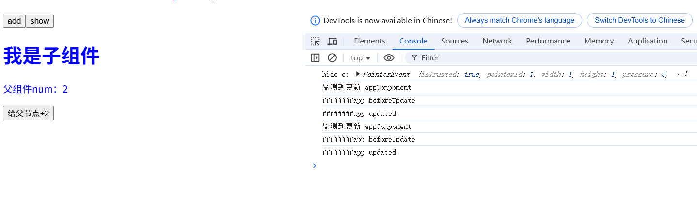
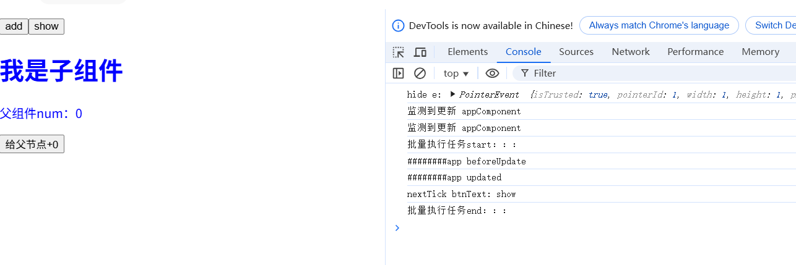

# vue任务调度器-实现dom异步批量更新
前面我们已经完成了vue渲染管线的编译、挂载和更新了，框架的核心机制已经完成。

不过注意观察的同学，会发现在点击hide之后，appComponent执行了2次更新,这是因为hide按钮的点击导致了2个变量的更改。这里应该再优化优化，做到像vue一样异步批量处理dom更新。

另外说到dom异步更新，你是否想到nextTick方法？
如果dom更新是异步的，那怎么获取更新之后的dom呢？vue提供了nextTick方法，它的回调函数会在dom更新之后立即执行，vue是怎么做到的呢？

## 任务调度器要点
我们可以把dom更新看做是一项任务，nextTick回调也看成是一项任务，这就涉及到任务调度机制。
说到任务调度机制，你是否还记得event loop机制？
它就是处理异步任务的关键，还有微任务和宏任务，微任务优先级比宏任务更高，当前宏任务执行完就会清空微任务列表
而vue把dom更新任务和nextTick任务都处理成了微任务，这样能让它们尽快被执行，vue实现了一套自己的任务调度机制。

总结下任务调度器的要点：
1. 把dom更新任务和nextTick任务都处理成微任务
2. 保证dom更新任务在nextTick任务之前执行
3. dom更新任务实现批量处理，避免频繁更新

要实现1，需要创建微任务，哪些方式可以创建微任务呢？
不记得的再回顾下文章:[彻底弄懂事件循环机制eventloop](),vue根据兼容性依次采用Promise,MutationObserver,setImmediate,setTimeout来实现的，前两者会创建微任务，后两者会创建宏任务

要实现2，怎么保证dom更新任务一定在nextTick任务之前执行？
dom更新任务放到一个任务队列里，nextTick回调放到另一个任务队列里，等待任务批处理正式执行时，先清空dom更新任务队列，再清空nextTick任务队列

要实现3，怎么对dom更新进行批处理，避免频繁更新呢？
用Set保存需要更新的组件，可以避免组件重复添加，最后只执行一次更新

## 任务调度器模拟实现
```js

// 任务调度器
import { update } from './runtime'
// nextTick任务列表
const nextTickTasks = []
// dom更新任务列表
const updateDomTasks = new Set()
// 是否有未执行的微任务
let hasMicroTask = false

let observer = null
const dom = document.createTextNode('1')
// 创建微任务
// 参数cb:nextTick回调
// 参数instance:需要更新的组件实例
const createMicroTask = function (cb, instance) {
  // 任务放进队列
  if (cb) {
    nextTickTasks.push(cb)
  }
  if (instance) {
    updateDomTasks.add(instance)
  }
  // 所有的任务会放到一个微任务里处理
  // 如果已有未执行的微任务，不做处理
  if (!hasMicroTask) {
    // 根据兼容性创建微任务
    if (typeof Promise !== 'undefined') {
      Promise.resolve().then(batchDealTasks)
    } else if (typeof MutationObserver !== 'undefined') {
      if (observer && dom) {
        dom.textContent = dom.textContent + '1'
      } else {
        observer = new MutationObserver(batchDealTasks)
        observer.observe(dom, { characterData: true })
        dom.textContent = '1'
      }
    } else if (typeof setImmediate !== 'undefined') {
      setImmediate(batchDealTasks)
    } else {
      setTimeout(batchDealTasks)
    }
    hasMicroTask = true
  }
}
// 批量处理任务
const batchDealTasks = function () {
  console.log('批量执行任务start：：：')
  // 先dom更新
  updateDomTasks.forEach((instance) => update(instance))
  // 再执行nextTick的任务
  nextTickTasks.forEach((cb) => cb())

  console.log('批量执行任务end：：：')
  // 重置任务队列
  nextTickTasks.length = 0
  updateDomTasks.clear()
  // 微任务已经执行，hasMicroTask重置为false
  hasMicroTask = false
}
export const $nextTick = function (cb) {
  createMicroTask(cb, null)
}
export const $domUpdate = function (instance) {
  createMicroTask(null, instance)
}
```
## 应用
```js
// appComponent.js
export default {
  name: 'appComponent',
  setup() {
    // 其他原代码...
    // btnText 方法里通过nextTick获取hide按钮的文案
    const btnText = computed(() => {
      $nextTick(() => {
        const bthText = document.getElementById("1").childNodes[1].innerText
        console.log("nextTick btnText:", bthText)
      })
      return isShow.value ? 'hide' : 'show'
    })  
  }
}

```
```js
//runtime.js
// 其他原代码...
import { $domUpdate } from './scheduler'
const commonMount = function ({ instance, parentDom, insertIndex }) {    
    watchEffect(() => {
        // 判定实例状态，如果未挂载，则进行挂载操作，已挂载则进行更新
        if (!instance.isMounted) {
           //...
        } else {
            // update
            console.log("监测到更新", instance.name)
            //update(instance)
            $domUpdate(instance)
        }
    })
}
```
执行效果：

可以看到，点击hide按钮后，检测到2次数据更新，但是update只执行了一次。而且nextTick的回调在更新之后执行，并准确拿到了按钮的文案