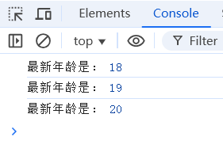
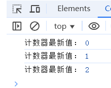
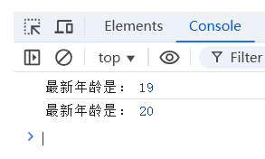
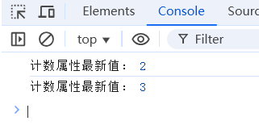

# Vue响应式系统实现剖析
## 一、vue reactive
Vue 的reactive函数是实现响应式数据的核心机制，它基于 JavaScript 的 Proxy（代理）模式。下面用生活化的比喻解释这个概念：
### 什么是代理模式?
想象你是一位忙碌的明星，粉丝想找你签名、预约活动，但你没时间直接处理。于是你雇了一位经纪人（代理）：
粉丝的所有请求都先经过经纪人。
经纪人可以拦截粉丝请求（比如过滤不合理的要求），也可以通知粉丝你最近有什么动态（触发更新）。
对你来说，生活没变，但所有的工作都被 “代理” 了，这样你就会更加轻松。
这就是 Proxy 模式的核心：在对象和外部访问之间加一层中间层，拦截并控制对对象的访问，且不更改对象本身。
### reactive如何设计的?
reactive 实际上做了两件事：
1. 创建 Proxy 对象：用 JavaScript 的Proxy包裹原始对象。
2. 设置拦截器：监听对象属性的get（读取）和set（修改）操作。
拦截器的实现：
2.1 读取属性（get 拦截）
当你访问reative对象属性S时：
实际触发 Proxy 的get拦截器。
Vue 会记录 “有人读取了S属性”，并收集依赖（记住哪些组件 / 计算属性依赖这个值）。
比喻：
经纪人记录 “粉丝 A 问了明星的年龄”，并悄悄记下 “A 对年龄感兴趣”。
2.2 修改属性（set 拦截）
当你修改reative对象属性S时：
实际触发 Proxy 的set拦截器。
Vue 会检查新值是否不同，如果不同则触发更新（通知所有依赖S的组件重新渲染）。
比喻：
经纪人得知 “明星的年龄改成 30 岁了”，立刻通知所有关注年龄的粉丝：“年龄更新啦！”

### reactive 代码实现
```core.js
// core.js
// 建立源对象和代理之间的映射，避免重复代理
const reactiveMap = new WeakMap()
// reative代理对象，支持深层嵌套
export const reactive = function (obj) {
    if (typeof obj !== 'object' || obj === null) {
        return obj // 非对象或 null 不需要代理
    }
    // 已经有代理直接返回
    if (reactiveMap.has(obj)) {
        return reactiveMap.get(obj)
    }
    // reactive做两件事，1：生成一个proxy对象，2.做get，set拦截
    const proxy = new Proxy(obj, {
        get(target, key) {
            // 收集订阅者
            track(target, key)
            let value = target[key]
            if (typeof value === 'object') {
                return reactive(value)
            } else {
                return value
            }
        },
        set(target, key, value) {
            target[key] = value
            // 触发更新
            trigger(target, key)
            // set必须设置返回
            return true
        },
    })
    // 目标对象和代理对象建立映射关系
    reactiveMap.set(obj, proxy)
    return proxy
}
// dom更新是副作用，watchEffect回调是副作用，可以把副作用看成是订阅者
let currentEffect = null

// 收集订阅者
const track = function (target, key) {
  if (!currentEffect) return
  // 获取现有的订阅者
  const listeners = getListeners(target, key)
  // 添加订阅者
  listeners.add(currentEffect)
}
// 订阅者集合，使用如下3级结构
// WeakMap<target, Map<key, Set<effect>>>
// 为啥外层是weakMap，里层是Map？
// WeakMap是弱引用，方便内存回收，但是key必须为对象
// 副作用用Set存储而不是数组，避免重复添加
const listenersWeakMap = new WeakMap()
// 获取订阅者
const getListeners = function (target, key) {
  // 如果当前还没有订阅者，会先初始化
  if (!listenersWeakMap.has(target)) {
    listenersWeakMap.set(target, new Map())
  }
  const targetMap = listenersWeakMap.get(target)
  if (!targetMap.has(key)) {
    targetMap.set(key, new Set()) // 使用set避免重复添加！！！
  }
  return targetMap.get(key)
}
// 触发更新
const trigger = function (target, key) {
  // 获取现有的订阅者
  const listerners = getListeners(target, key)
  // 执行副作用
  listerners.forEach((listerner) => {
    listerner()
  })
}
```
在上面的收集订阅者中,收集的是currentEffect,但是currentEffect并未被设置值，它可以是watchEffect回调，可以是组件的更新等，先来看看watchEffect

## 二、vue watchEffect
### 什么是watchEffect?

watchEffect 就像一个 “自动续杯的服务员”。
你坐在咖啡店的座位上，点了一杯拿铁（某个响应式数据），帮小孩点了一杯果汁(另一个响应式数据)。服务员（watchEffect）过来记下你喝的是拿铁，小孩喝的是果汁（自动记住依赖的变量）。
当你把拿铁喝完了或者小孩喝的果汁喝完了（数据变了），不用你喊 “再来一杯”，服务员直接默默给续上（自动重新执行代码）。
简单说就是：你写一段依赖数据的逻辑，watchEffect 自动帮你盯着这些数据，数据变了就重跑逻辑，省得你一个个指定要监听谁。

### watchEffect代码实现
```core.js
// core.js
export const watchEffect = function (update) {
  const effect = () => {
    currentEffect = effect
    update()
    currentEffect = null
  }
  // 立即执行，在这个过程中会自动收集依赖
  effect()
}
```
现在来验证下功能：
```test.js
// test
const obj = reactive({ name: 'zhangsan', age: 18 })
watchEffect(() => {
    console.log('最新年龄是：', obj.age)
})
obj.age = 19
obj.age = 20
```
执行结果：


### watchEffect解析
它的实现代码很简单，构造了一个副作用函数effect，把当前currentEffect设置为effect，然后执行update函数，最后再把currentEffect设置为null。
它的特点是effect会立即执行，也就是update函数会立即执行，函数里使用到了哪些响应式数据，便会触发get劫持，也就会触发依赖收集，这就是自动收集依赖的关键！

## 三、ref
### ref如何设计的？
ref返回一个特定的对象，它专门有一个 value 属性，用来存储值。
ref跟reactive使用proxy代理不一样，是直接对value属性进行get，set劫持
ref一般用来包裹基本类型的值，也可以包裹对象。如果被包裹值为对象，那么会自动调用reactive方法，把对象变成响应式的。

### ref代码实现
```core.js
// core.js
// ref的默认值可以是普通类型，也可以是对象，如果是对象，会再封装成reactie
export const ref = function (defaultV) {
    const refObj = {
        get value() {
            track(this, 'value')
            if (typeof defaultV === 'object') {
                return reactive(defaultV)
            } else {
                return defaultV
            }
        },
        set value(v) {
            defaultV = v
            trigger(this, 'value')
        },
    }
    return refObj
}
```
现在来验证下功能：
```core.js
// test
const countRef = ref(0)
watchEffect(() => {
    console.log('计数器最新值：', countRef.value)
})
countRef.value = 1
countRef.value = 2
```
执行结果：


## 四、vue watch
watch 就像一个 “指定盯梢员”—— 你得明确告诉它：“我要盯着 A 数据，只要 A 变了，你就去做 B 这件事”。
比如你跟同事说：“你帮我盯着前台的快递，如果有我的快递到了（A 变了），就马上叫我去取（做 B）”。
这里的关键是：必须先说清楚 “盯什么”，它才会在 “被盯的东西变了” 之后执行你安排的动作。
与watchEffect不同的点就在于，watch需要明确告诉它盯什么，而watchEffect不需要！

### watch代码实现
```
// core.js
// watch可以监听ref、reactive对象和getter函数
// 这里watch会立即执行，并深层监听
// 监听返回响应式属性的getter函数，可以精确监听reactive的某个属性，而不是全部属性。
// 但如果这个属性是对象，只有在返回不同的对象时，才会触发回调，也就是说非深层监听

export const watch = function (dependency, cb) {
    let oldValue
    if (typeof dependency === 'function') {
        // getter函数
        oldValue = dependency()
        watchEffect(() => {
            const newValue = dependency()
            if (oldValue !== newValue) {
                cb(newValue, oldValue)
                oldValue = newValue
            }
        })
    } else {
        // 深度拷贝对象
        let oldClone = JSON.parse(JSON.stringify(dependency))
        watchEffect(() => {
            // 比较变化
            if (JSON.stringify(oldClone) !== JSON.stringify(dependency)) {
                // 如果是ref，返回value
                if (dependency.value) {
                    cb(dependency.value, oldClone?.value)
                } else {
                    cb(dependency, dependency)
                }
                oldClone = JSON.parse(JSON.stringify(dependency))
            }
        })
    }

}
```

现在来验证下功能：
```core.js
// test
const obj = reactive({ name: 'zhangsan', age: 18 })
watch(obj, () => {
    console.log('最新年龄是：', obj.age)
})
obj.age = 19
obj.age = 20
```
执行结果：



## 五、vue computed
computed 就像一个 “自动更新的计算器”。
比如你有两个数字：一个是 “苹果的单价”（响应式数据 A），一个是 “买的数量”（响应式数据 B）。
你告诉 computed：“帮我算一下‘单价 × 数量’的总价”。
它会记住自己依赖了 A 和 B，然后算出一个结果。
之后，只要 A 或 B 变了（比如单价涨了，或者多买了几个），它会自动重新算一遍总价，不用你再手动按计算器。
如果A和B都没有变化，那么它就会返回原来的值，不会重新计算

计算属性和watch，watchEffect一样，都能实现监听的功能，并且能自动收集依赖，但是计算属性本质还是个属性！返回ref对象，并带有缓存功能，只有依赖的变量发生变化，才会重新计算。

### 代码实现
```core.js
export const computed = function (cb) {
    const resRef = ref()
    const effect = () => {
        currentEffect = effect
        resRef.value = cb()
        currentEffect = null
    }
    effect()
    return resRef
}
```
现在来验证下功能：
```core.js
// test
const countRef = ref(0)
const computedRef = computed(() => {
    return countRef.value + 1
})
watch(computedRef, () => {
    console.log('计数属性最新值：', computedRef.value)
})
countRef.value = 1
countRef.value = 2
```
执行结果：


## 最后
这篇文章带大家一起简单模拟了下vue响应式各功能的代码实现，主要是为了理解vue响应式的原理，代码实现比较简单，没有考虑一些边界情况以及多类型场景。更详细的模拟代码请参考[vue 响应式原理](https://github.com/makye-ame/MyVue/blob/main/src/libs/core.js)