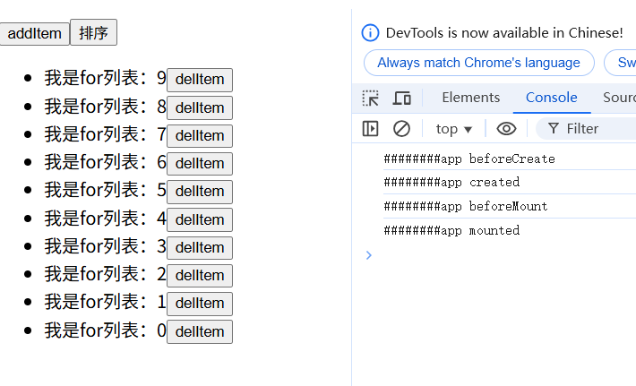
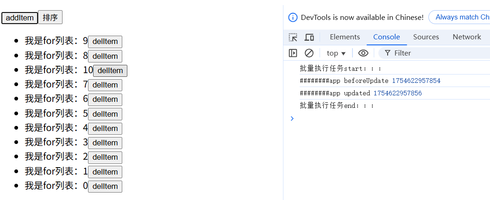
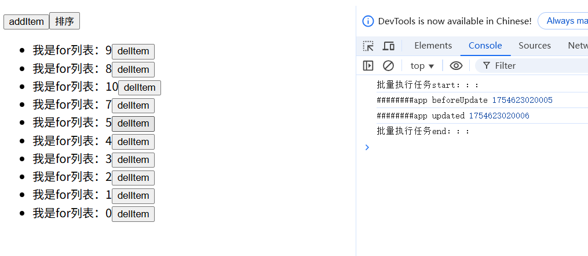
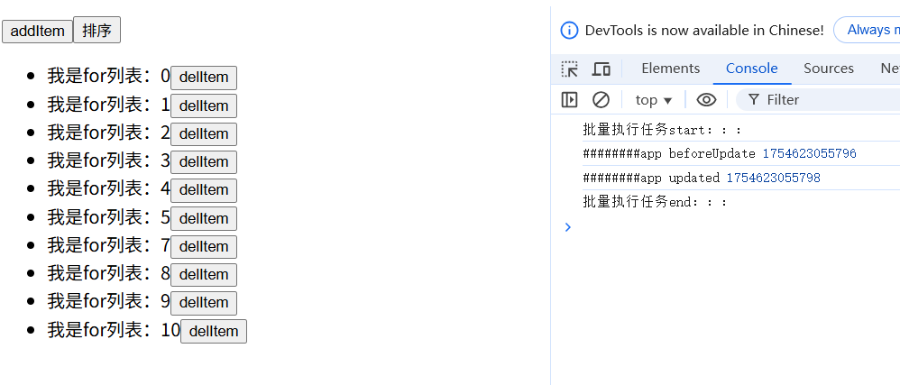
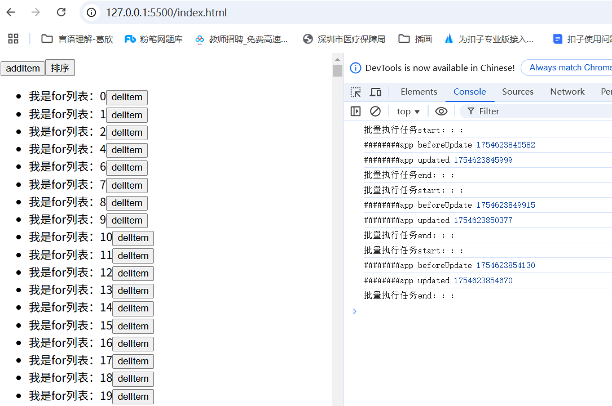

# vue指令v-for
在我们前面的模拟里，没有实现v-for指令，这一节中，我们在原有基础上进一步实现v-for指令。

## 代码实现
```js
// compiler.js
function digui(obj) {
    let str = ''
    // 对于不同的type，处理逻辑不同，文本和插槽比较简单，创建一个文本虚拟dom即可；
    // ELEMENT比较复杂，需要拼接子节点字符串，属性字符串，而属性还包括指令的处理(这里只简单模拟v-if)再创建一个元素虚拟dom
    switch (obj.type) {
        case TYPE.ROOT:
        case TYPE.ELEMENT:
            // 拼接子节点字符串-稍做调整
            let childStr = obj.children?.length > 0
                ? obj.children.map((child) => digui(child)).join(', ')
                : '[]';
            const isAlreadyArray = /^this\..*\.map/.test(childStr) || childStr.startsWith('[');
            if (!isAlreadyArray) {
                childStr = `[${childStr}]`
            }
            // 拼接属性字符串
            // ...
            if (obj.attrs?.['v-if']) {
                // ...
            } else if (obj.attrs?.hasOwnProperty('v-for')) {
                // 增加v-for指令的处理
                const v = obj.attrs['v-for'].exp;
                const exp = /(.+) in (\w+)/;
                const match = v.match(exp);

                if (!match || match.length < 3) {
                    throw new Error('v-for 表达式格式不正确，应为 "item in items"');
                }

                const [_, alias, source] = match;
                const keyExp = obj.attrs['key']?.exp || 'item';

                // v-for 生成的 childStr 是一个数组表达式
                const tagStr = getTag(obj.tag)
                const vforStr = `this.${source}?.map((${alias}) => {
                    return createVNode(${tagStr}, { key: ${keyExp} }, ${childStr})
                })`;

                str += vforStr;
            } else {
                //...
            }
            // ...
    }
    // ...    
}
// 获取动态值的字符串-稍做调整
const getExpStr = function (exp) {
    // 这里是最简单的模拟，没有考虑过多
    // 当前环境下直接取值，v-for会开启新的块作用域    
    const currentExp = `(typeof ${exp} !== 'undefined' ? ${exp} : undefined)`
    // 从当前上下文中取值，考虑值为ref的情况
    const thisExp = `(this.${exp}?.value ?? this.${exp})`;
    // 从props里取值,在vue里，会把props封装成reactive对象
    const propExp = `(this.props?.${exp})`
    // 优先取当前作用域下的值，最后是props的值    
    return `(${currentExp} ?? ${thisExp} ?? ${propExp})`;
}
```
## 应用
```js
// appComponent.js
import { reactive } from './libs/core.js'
// 定义模板
const template = `
  <div>    
   <button  @click="addItem(444)">addItem</button>
   <button  @click="sort">排序</button> 
   <ul>
      <li v-for="item in items" :key="item.id">
        我是for列表：{{item.text}}
        <button  @click="delItem(item)">delItem</button>        
      </li>
   </ul>  
 </div>
 `
export default {
  name: 'appComponent',
  template,
  setup() {
    // 新增列表逻辑
    const array = new Array(10).fill(0).map((i, k) => {
      return { id: k, text: k }
    }).reverse()
    let index = array.length - 1
    const items = reactive(array)
    const addItem = () => {
      index++
      items.splice(2, 0, { id: index, text: index })
    }
    const delItem = (item) => {
      const index = items.findIndex((i) => i.id === item.id)
      items.splice(index, 1)
    }
    const sort = () => {
      items.sort((item1, item2) => {
        return item1.id - item2.id
      })
    }

    return {     
      // 新增列表逻辑
      items,
      addItem,
      delItem,
      sort
    }
  },
  // 其他生命周期函数...
}  
```
## 暴露的问题
数组的删除和添加操作，会导致后续所有数据项的修改，从而触发了响应式系统的多次set劫持，trigger了多次更新。
目前响应式数据reactive的实现比较简单，需要做下优化工作
```js
// core.js
// 优化对数组的代理
// 数组的删除增加会导致后续的项都更改，从而触发了多次拦截，这不是我们想要的
// 所以我们需要覆盖数组的方法，返回数组变异方法，在方法里统一触发一次更新
// 如果是数组变异方法导致数组的修改，直接跳过触发（已在上一步中手动触发）
// 拦截数组的方法
const arrayMethods = ['push', 'pop', 'shift', 'unshift', 'splice', 'sort', 'reverse']
let isMutating = false  // 是否正在执行变异方法
export const reactive = function (obj) {
    if (typeof obj !== 'object' || obj === null) {
        return obj // 非对象或 null 不需要代理
    }
    // 已经有代理直接返回
    if (reactiveMap.has(obj)) {
        return reactiveMap.get(obj)
    }
    // reactive做两件事，1：生成一个proxy对象，2.做get，set拦截
    const proxy = new Proxy(obj, {
        get(target, key) {
            // 收集订阅者
            track(target, key)
            let value = target[key]
            // 拦截数组的方法，返回数组变异方法，在方法里统一触发一次更新
            if (Array.isArray(target) && arrayMethods.includes(key)) {
                return function (...args) {
                    isMutating = true
                    const res = target[key].apply(this, args)
                    isMutating = false
                    // 触发更新
                    trigger(target, 'length')
                    return res
                }

            }
            if (typeof value === 'object') {
                return reactive(value)
            } else {
                return value
            }
        },
        set(target, key, value) {
            // 判断新旧值不等
            if (target[key] !== value) {
                target[key] = value
                // 触发更新
                // 如果是数组变异方法导致的修改，直接跳过触发（已在包装方法中手动触发）
                if (!isMutating) {
                    trigger(target, key)
                }
            }
            // set必须设置返回
            return true
        },
    })
    // 目标对象和代理对象建立映射关系
    reactiveMap.set(obj, proxy)
    return proxy
}
```


## 运行结果
初始挂载：

点击添加按钮：

点击删除按钮：

点击排序按钮：


## 扩展
如果列表数据非常大，比如10000条数据，会怎样？
我试了下，还行。

但是如果数据再大，20000条数据，就会出现明显的卡顿
下一篇我们讲讲vue3里的编译优化