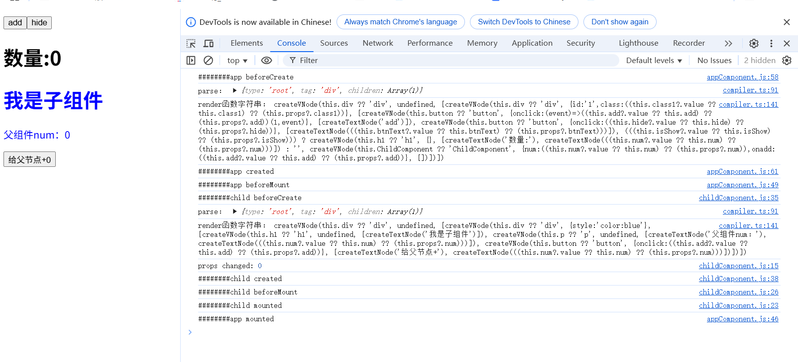
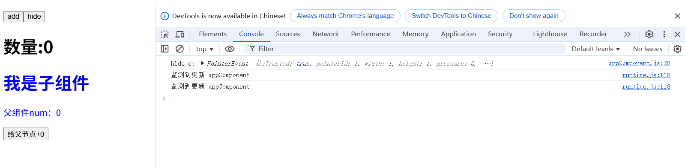

# vue原理深度剖析：渲染管线-挂载
在看这篇文章之前建议阅读下vue官方文档:[渲染机制](https://cn.vuejs.org/guide/extras/rendering-mechanism.html)
文章里提到渲染管线有几个事：编译、挂载、更新。本文讲的是挂载阶段。编译阶段见上篇文章

## 挂载阶段分析

- 组件的内容有模版(template或render函数)，数据、方法(通过setup函数返回)，模版可以访问setup函数返回的数据，还有一些生命周期函数
- 涉及到组件的实例化，组件是多例模式，每个引入的地方都会创建自己的实例
- 组件实例在不同阶段会触发不同的生命周期函数
- 涉及到应用的实例化，提供createApp创建应用实例，实例包含mount函数提供挂载功能
- 挂载阶段的功能：调用渲染函数，遍历返回虚拟 DOM 树，并基于它创建实际的 DOM 节点
- 挂载需要作为响应式副作用执行，它才会追踪其中所用到的所有响应式依赖。
- 根组件的挂载由用户手动调用app.mount方法触发，在挂载阶段遇到子组件，会触发子组件的实例化和挂载

## 实现设计
1. 组件配置对象
```js
const component = {
  name: 'appComponent',
  // 参数1：响应式props对象, 父组件传递的props
  // 参数2：组件上下文，提供emit(事件派发方法)等
  setup(props,ctx) {  
    return {
      //...
    }
  },  
  render:()=>{}, // 如果和template同时申明，会优先render函数
  template: '...', 
  //  生命周期函数
  mounted() {
    console.log('########app mounted')
  },
  // 其他生命周期函数
}
```
2. 组件实例(这里只简单模拟给组件传props的情况，暂不考虑组件插槽)

```js
// 参数1:组件配置对象component
// 参数2:组件节点的props属性
// 参数3:父组件实例_instance

const createComponentIntance = function (component, props, _instance) {
  // 1.触发beforeCreate事件钩子
  // 2.根据template获取render函数
  // 3.包装props为响应式
  // 4.初始化组件上下文context，也就是setup函数的返回值  
  // 5.把响应式props挂载到context，方便模板中直接访问props中的数据
  // 6.绑定render函数执行的上下文context
  // 7.生成组件实例
  // const instance = {
  //   ...component,
  //   vnode: null, // 预留属性，后续挂载时生成，与组件的虚拟DOM树建立映射
  //   render, 
  //   context, 
  //   props,
  // }
  // 8.建立组件父子映射，方便父子之间的通信
  // 9.触发created事件钩子
  // 10.返回实例 
}
```
3. 应用实例化
```js
// 提供createApp方法创建应用实例
// 接收组件配置对象作为参数
export const createApp = function (component) {
    // 1.创建根组件实例
  const instance = createComponentIntance(component)
  // 2.实例提供mount方法
  instance.mount = function (selector) {
    // 3.挂载会作为响应式副作用执行，这样它会追踪其中所用到的所有响应式依赖。
     watchEffect(() => {
        // 4.根据render渲染函数生成rootVnode
        // 5.根组件实例与rootVnode建立双向映射，方便后续操作
        // 6.触发beforeMount生命周期钩子  
        // 7.执行实际挂载mount操作
        // 8.触发mounted生命周期钩子
        // 9.更改组件的挂载状态
     })
  }
  // 提供unmount方法
}
```
**重点**：
从第4步开始的挂载作为一个副作用，都放到watchEFfect中执行，这样才能捕获到需要监听哪些数据的变化。下次数据更新了，需要重新根据render渲染函数生成新的虚拟dom树，再进行其他对比更新操作
为什么可以自动捕获到需要监听的数据变化？
因为组件的渲染函数中使用了响应式数据，渲染函数会在组件挂载时执行一次，也就会触发数据的get操作，从而收集依赖。

4. 挂载
```js
// 参数instance：当前挂载的组件实例
// 参数vnode：当前要挂载的虚拟dom节点
// 参数parentDom：指定要挂载的父元素
// 参数insertIndex：插入位置，指定要挂载的位置，可选参数，不传则挂载在末尾
const mount = function ({instance,vnode, parentDom, insertIndex}) {
    // 如果当前虚拟dom是组件
    if (typeof vnode.tag === 'object') {
       // 1.创建子组件实例
       // 2.挂载会作为响应式副作用执行，这样它会追踪其中所用到的所有响应式依赖。
      watchEffect(() => {
      // 3.根据render渲染函数生成Vnode
      // 4.子组件实例与组件虚拟dom Vnode建立映射
      // 5.触发beforeMount生命周期钩子
      // 6.执行子组件挂载操作
      // 7.触发mounted生命周期钩子
      // 8.更新组件的挂载状态
       })
    }else{
      // 普通虚拟dom
      // 1.创建真实dom
      // 2.递归处理dom的子节点挂载
      // 3.插入dom
    }
}
```

可以看到2-8点和第3步createApp的3-9点是一样的，可以把这部分再抽离出来。
```js
const commonMount = function ({instance, parentDom, insertIndex}) {
  // 2.挂载会作为响应式副作用执行，这样它会追踪其中所用到的所有响应式依赖。
      watchEffect(() => {
      // 3.根据render渲染函数生成Vnode
      // 4.子组件实例与组件虚拟dom Vnode建立双向映射
      // 5.触发beforeMount生命周期钩子
      // 6.执行子组件挂载操作
      // 7.触发mounted生命周期钩子
      // 8.更新组件的挂载状态
       })
}
```

如果当前是普通虚拟dom，就会创建真实的dom，我们把这部分逻辑也抽离出来
```js
// 参数instance：当前挂载的组件实例
// 参数vnode：当前要挂载的虚拟dom节点
// 参数parentDom：父元素dom
// 参数insertIndex：插入位置，指定要挂载的位置，可选参数，不传则挂载在末尾
const createDomDuiGui = function({ instance,vnode, parentDom, insertIndex }) {
  // 1.创建真实dom
  // 2.递归处理dom的子节点挂载
  // 3.插入dom
}
```
## 代码实现
```js
import h from './help.js'
import { parse, generate } from './compiler.js'
import { watchEffect, reactive } from './core.js'
import { $domUpdate } from './scheduler.js'
// 参数1:组件配置对象component
// 参数2:组件节点的props属性
// 参数3:父组件实例_instance
const createComponentIntance = function (component, props = {}, _instance) {
    // 1.触发beforeCreate事件钩子
    if (component.beforeCreate) component.beforeCreate()
    // 2.根据template获取render函数
    const { template, render, setup } = component
    let renderFun = render
    // 编译模板
    if (!render && template) {
        const ast = parse(template)
        renderFun = generate(ast)
    }
    // 3.包装props为响应式
    const reactiveProps = reactive(props)
    // 4.初始化组件上下文context，也就是setup函数的返回值
    // 先构建setup函数的第2个参数ctx
    const ctx = {
        emit(eventStr, ...args) {
            // emit函数逻辑处理
            // 这里根据props找到父级的处理函数
            const method = props['on' + eventStr]
            if (method) {
                method(...args)
            }
        },
    }
    const context = setup?.(reactiveProps, ctx) || {}
    // 5.把响应式props挂载到context，方便模板中直接访问props中的数据
    context.props = reactiveProps
    // 6.绑定render函数执行的上下文context
    renderFun = renderFun.bind(context)
    // 7.生成组件实例
    const instance = {
        ...component,
        vnode: null, // 预留属性，后续挂载时生成，与组件的虚拟DOM树建立映射
        render: renderFun,
        context,
        props: reactiveProps,
    }
    // 8.建立组件父子映射，方便父子之间的通信
    instance.parent = _instance
    // 9.触发created事件钩子
    if (component.created) component.created(instance)
    // 10.返回实例 
    return instance
}
// 提供createApp方法创建应用实例
// 接收组件配置对象作为参数
export const createApp = function (component) {
    // 1.创建根组件实例
    const instance = createComponentIntance(component)
    // 2.实例提供mount方法
    instance.mount = function (selector) {
        const parentDom = document.querySelector(selector)
        // 3.挂载会作为响应式副作用执行，这样它会追踪其中所用到的所有响应式依赖。
        commonMount({ instance, parentDom })

    }
    // 4.提供unmount方法
    instance.unmount = function () {
        if (instance.isMounted) {
            // 触发app的beforeUnmount事件
            instance.beforeUnmount?.()
            const rootDom = instance.vnode.el.parentElement;
            removeDomByVnode(instance.vnode, rootDom);
            instance.isMounted = false;
            // 触发app的unmounted事件
            instance.unmounted?.()
        }

    }
    return instance
}
// 参数instance：当前挂载的组件实例
// 参数vnode：当前要挂载的虚拟dom节点
// 参数parentDom：指定要挂载的父元素
// 参数insertIndex：插入位置，指定要挂载的位置，可选参数，不传则挂载在末尾
const mount = function ({ instance, vnode, parentDom, insertIndex }) {
    // 如果当前虚拟dom是组件
    if (typeof vnode.tag === 'object') {
        
        // 1.创建子组件实例,节点的component属性指向组件实例
        const childIntance = createComponentIntance(vnode.tag, vnode.props, instance)

        vnode.component = childIntance
        // 2.挂载会作为响应式副作用执行，这样它会追踪其中所用到的所有响应式依赖。
        // watchEffect(() => {
        //     // 3.根据render渲染函数生成Vnode
        //     // 4.子组件实例与组件虚拟dom Vnode建立双向映射
        //     // 5.触发beforeMount生命周期钩子
        //     // 6.执行子组件挂载操作
        //     // 7.触发mounted生命周期钩子
        //     // 8.更新组件的挂载状态
        // })
        commonMount({ instance: childIntance, parentDom, insertIndex })
    } else {
        // 普通虚拟dom
        // 1.创建真实dom
        // 2.递归处理dom的子节点挂载
        // 3.插入dom
        createDomDuiGui({ instance, vnode, parentDom, insertIndex })
    }
}
const commonMount = function ({ instance, parentDom, insertIndex }) {
    // 2.挂载会作为响应式副作用执行，这样它会追踪其中所用到的所有响应式依赖。
    watchEffect(() => {
        // 判定实例状态，如果未挂载，则进行挂载操作，已挂载则进行更新
        if (!instance.isMounted) {
            // 3.根据render渲染函数生成Vnode
            const vnode = instance.render(h.createVNode, h.createTextNode);
            // 4.子组件实例与组件虚拟dom Vnode建立映射            
            instance.vnode = vnode;
            // 5.触发beforeMount生命周期钩子
            instance.beforeMount?.(instance);
            // 6.执行子组件挂载操作
            mount({ instance, vnode, parentDom, insertIndex })
            // 7.触发mounted生命周期钩子
            instance.mounted?.(instance)
            // 8.更新组件的挂载状态
            instance.isMounted = true
        } else {
            // update
            console.log("监测到更新", instance.name)
            //update(instance)
            $domUpdate(instance)
        }
    })
}
// 参数instance：当前挂载的组件实例
// 参数vnode：当前要挂载的虚拟dom节点
// 参数parentDom：父元素dom
// 参数insertIndex：插入位置，指定要挂载的位置，可选参数，不传则挂载在末尾
const createDomDuiGui = function ({ instance, vnode, parentDom, insertIndex }) {
    if (!vnode) return
    let dom
    // 1.创建真实dom
    dom = document.createElement(vnode.tag)
    // 虚拟节点与真实节点建立映射
    vnode.el = dom
    // 设置dom属性
    for (let k in vnode.props) {
        const v = vnode.props[k]
        if (k === 'style') {
            // style属性值支持字符串和对象
            if (typeof v === 'object') {
                for (let styleK in v) {
                    dom.style[styleK] = v[styleK]
                }
            } else {
                dom.style = v
            }
        } else if (k.startsWith('on')) {
            // 事件

            dom.addEventListener(k.slice(2), v)
        } else {
            dom.setAttribute(k, v)
        }
    }

    // 2.递归处理dom的子节点挂载
    vnode?.childrens?.forEach((child, key) => {
        if (typeof child !== 'object') {
            // 普通文本           
            dom.textContent += child
        } else if (child.tag || child.mount) {
            // 处理子节点的挂载
            mount({ instance, vnode: child, parentDom: dom, insertIndex: key })
        } else {
            dom.textContent += JSON.stringify(child)
        }
    })

    // 3.插入dom
    if (typeof insertIndex !== 'number' || insertIndex >= parentDom.childNodes.length) {
        parentDom.appendChild(dom)
    } else {
        const refNode = parentDom.childNodes[insertIndex]
        parentDom.insertBefore(dom, refNode)
    }
}
// 根据虚拟节点移除真实dom
// 这里有一个注意点：删除操作是先逻辑-后dom，也就是说先执行unmount，然后才删除真实dom
// 这样在unmount函数里依然可以访问到dom，另外组件的事件监听（如 window.scroll）、计时器等资源，需要在 DOM 移除前清理，否则会残留引用，导致内存泄漏。
// 如果子节点里有组件，需要递归处理子组件的卸载，但是dom的删除统一删除父节点即可！
function removeDomByVnode(vnode, parentDom) {
    // 先逻辑删除
    unmountComponent(vnode)
    // 后删除真实dom
    const dom = vnode.el || vnode.component?.vnode?.el;
    parentDom.removeChild(dom);
}
function unmountComponent(vnode) {   
    // 1.触发 beforeUnmount 钩子    
    vnode?.component?.beforeUnmount?.();
    // 2. 递归处理子组件
    if (vnode.childrens && vnode.childrens.length > 0) {
        vnode.childrens.forEach(child => {
            unmountComponent(child)
        });
    }
    // 3.触发 unmount 钩子    
    vnode?.component?.unmount?.();

}
```

## 应用
```js
// appComponent.js
import { ref, computed } from './core.js'
import ChildComponent from './childComponent'
// 定义模板
const template = `
  <div id="1" :class="class1">
   <button  @click="add(1)">add</button>
   <button  @click="hide">{{btnText}}</button>
   <h1 v-if="isShow">数量:{{ num }}</h1>   
   <ChildComponent :num="num" @add="add"></ChildComponent>
 </div>
 `
export default {
  name: 'appComponent',
  template,
  setup() {
    const isShow = ref(true)
    const num = ref(0)
    const class1 = computed(() => {
      return num.value === 2 ? 'red' : ''
    })
    const add = function (step = 1, e) {
      console.log("add e:", e)
      num.value = num.value + step
    }

    const hide = (e) => {
      console.log("hide e:", e)
      isShow.value = !isShow.value
    }
    const btnText = computed(() => {
      return isShow.value ? 'hide' : 'show'
    })

    return {
      ChildComponent,
      isShow,
      btnText,
      hide,
      class1,
      add,
      num
    }
  },
  mounted() {
    console.log('########app mounted')
  },
  beforeMount() {
    console.log('########app beforeMount')
  }, 
  beforeCreate() {
    console.log('########app beforeCreate')
  },
  created() {
    console.log('########app created')
  },
}

```

```js
//childComponent.js
import { watchEffect } from './core.js'
// 定义模板
const template = `
 <div style="color:blue">
   <h1> 我是子组件</h1>  
   <p>父组件num：{{num}}</p>
   <button  @click="add">给父节点+{{num}}</button>   
 </div>
 `
export default {
  name: 'childComponent',
  template,
  setup(props, ctx) {
    watchEffect(() => {
      console.log('props changed:', props.num)
    })
    const add = () => {
      ctx.emit('add', props.num)
    }
    return { add }
  },
  mounted() {
    console.log('########child mounted')
  },
  beforeMount() {
    console.log('########child beforeMount')
  },  
  beforeCreate() {
    console.log('########child beforeCreate')
  },
  created() {
    console.log('########child created')
  },
}

```
```js
//main.js
import { createApp } from './runtime.js'
import App from './appComponent.js'

createApp(App).mount('#app')
```
**挂载结果**



点击hide按钮后也能监听到变化，执行了watchEffect副作用回调，但页面并没有更新，因为还未处理更新的逻辑，更新逻辑详见下篇文章

