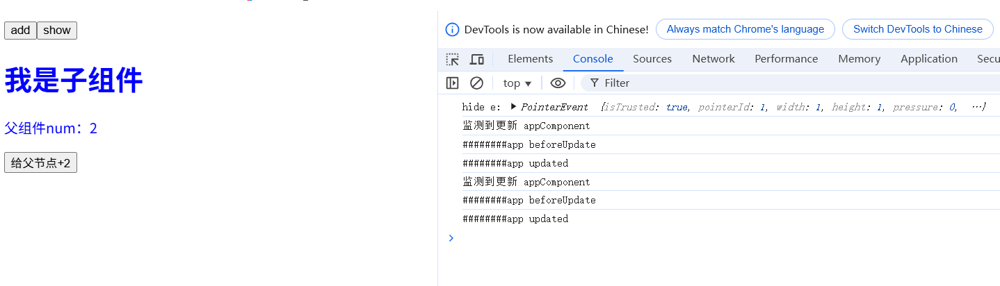

# vue原理深度剖析：渲染管线-挂载
在看这篇文章之前建议阅读下vue官方文档:[渲染机制](https://cn.vuejs.org/guide/extras/rendering-mechanism.html)
文章里提到渲染管线有几个事：编译、挂载、更新。本文讲的是更新阶段。编译和挂载阶段见上篇文章

## 更新阶段分析
在上篇挂载阶段，我们已经可以监听响应式数据的更新，今天的重点就是如何实现dom更新操作
```js
const commonMount = function ({ instance, parentDom, insertIndex }) {   
    watchEffect(() => {       
        if (!instance.isMounted) {
           // mount
        } else {
            // update
            // 今天的重点
            console.log("监测到更新", instance.name)
        }
    })
}
```
响应式数据更新后，会根据渲染函数生成新的虚拟dom树，需要对比新旧vnode树的区别，找到需要更新的地方，然后再执行必要的dom更新，这就是diff对比更新

**diff对比更新步骤：**
1. 如果节点不是同类型，直接删除创建新节点
2. 如果节点是同类型，属性有变化，且节点是普通节点，需要更新节点dom属性
3. 如果节点是同类型，属性有变化，且节点是组件节点，需要更新组件响应式props(响应式props更新后，会自动触发组件的更新)
4. 更新vnode.el,指向新的真实dom节点或组件
5. 处理子节点
- vue2中对比子节点是从左到右按顺序一一比对，vue3中采用两端对比：先处理两端相同类型节点的对比更新，再处理剩下的不同节点，会记录位置的移动，尽可能的复用节点
- 剩下的不同节点处理：
a. 对新节点建立key和位置的映射表
b. 遍历旧节点，映射表里找不到的旧节点表示应该删除，找到的进行对比更新
c.映射表里剩余的节点，表示新增节点
d.处理位置的移动，采用LIS算法进行最小移动

## 实现设计
1. 更新函数
```js
// 参数1:组件实例对象componentInstance
export const update = function (componentInstance) {
     // 1.触发beforeUpdate事件钩子
     // 2.获取旧的vnode树
     // 3.根据render函数获取新vnode树
     // 4.diff对比新旧节点，实现更新
     // 5.更新组件vnode树
     // 6.触发updated事件钩子
}
```
2.  diff对比更新
```js
// 对比更新
// 参数1:旧的Vnode树
// 参数2:新的Vnode树
// 参数3:父节点
// 参数4:在父节点中插入的位置
const diff = function (oldVnodeTree, VnodeTree, parentDom, insertIndex) {
// 1. 如果节点不是同类型，直接删除创建新节点
// 2. 如果节点是同类型，属性有变化，且节点是普通节点，需要更新节点dom属性
// 3. 如果节点是同类型，属性有变化，且节点是组件节点，需要更新组件响应式props(响应式props更新后，会自动触发组件的更新)
// 4. 更新vnode.el,指向新的真实dom节点或组件
// 5. 处理子节点
}

```

3. 判断是否是相同节点
```js
// 判断是不是相同节点
const isSameVNodeType = function (vnode1, vnode2) {
    // key值和tag都需一致
}
```
4. 子节点处理
```js
// 参数1：旧的子节点列表
// 参数2：新的子节点列表
// 参数3：父节点dom
const diffChildren = function (oldChildren, newChildren, parentDom) {
    // 1.两端进行对比
    // 2.如果列表已经对比完毕，处理新增和删除
    // 3.如果还有剩余不同节点，处理剩余节点
    // a. 对新节点建立key和位置的映射表
    // b. 遍历旧节点，映射表里找不到的旧节点表示应该删除，找到的进行对比更新，记录更新状态、更新虚拟dom的el指向新的dom节点
    // c.映射表里剩余的节点，表示新增节点
    // d.处理位置的移动，采用LIS算法进行最小移动
}
```
补充:
1. LIS算法是干什么的？
LIS算法可以找出最长递增子序列，如：
9,3,5,4,8  最长递增子序列就是3,4,8
0,2,3,1 最长递增子序列就是0,2,3
这里为了方便后续操作，我们让LIS算法返回最长递增子序列在原序列中的位置
也就是传递[9,3,5,4,8]给LIS函数，返回索引[1,3,4]
也就是传递[0,2,3,1]给LIS函数，返回索引[0,1,2]

2. 最长递增子序列跟最小移动有什么关系？
我们给新元素列表的节点建立其在旧节点的位置映射，这个位置映射是一个number数组，找出这个number数组的最长递增子序列， 最长递增子序列里对应的元素就不需要移动，不在这个序列里的才需要移动。
你可能还不理解为啥在最长递增子序列里的元素就不需要移动，不在这个序列里的才需要移动？
这个机制可以用排队理论来理解：
位置映射数组 相当于给每个新同学贴上学号标签（对应旧队列的位置）
最长递增子序列 就像找到一队已经按学号排好序的同学
不需要移动的同学 ：这些同学的学号自然递增，说明他们在旧队列的位置已经符合新队列的顺序
需要移动的同学 ：他们的学号破坏了递增性，必须调整位置来维持整体顺序
比如：
旧队列：小红，小美，小明，小张
新队列：小红(0) 小明(2) 小张（3）小美(1)
位置映射数组 = [0,2,3,1]（新队列同学在旧队列的位置）
最长递增子序列 = [0,2,3] ，不在这个子序列里的就是小美，所以只移动小美的位置即可
我们可以根据递增子序列一眼看出来，不在这个序列里的是小美，但对电脑来说，需要可执行的代码。为了方便找出需要移动的是小美，我们这里让LIS返回最长递增子序列在位置映射数组里的索引位置，[0,2,3]对应的索引位置就是[0,1,2],剩下索引位置3是需要移动的，新队列[3]就是小美

## 代码实现
```js
// ...挂载逻辑，见上篇文章代码实现
// 更新阶段
// 更新阶段
// 参数1:组件实例对象componentInstance
export const update = function (componentInstance) {
    // 1.触发beforeUpdate事件钩子
    if (componentInstance.beforeUpdate) componentInstance.beforeUpdate()
    // 2.获取旧的vnode树
    const oldVnode = componentInstance.vnode
    // 3.根据render函数获取新vnode树
    const newVnode = componentInstance.render(h.createVNode, h.createTextNode)
    // 4.diff对比新旧节点，实现更新
    diff(oldVnode, newVnode)
    // 5.更新组件vnode树
    componentInstance.vnode = newVnode
    // 6.触发updated事件钩子
    if (componentInstance.updated) componentInstance.updated()
}
// 判断是不是相同节点
const isSameVNodeType = (v1, v2) => {
    return v1.props?.key === v2.props?.key && v1.tag === v2.tag
}
// 对比更新
// 参数1:旧的Vnode树
// 参数2:新的Vnode树
// 参数3:父节点
// 参数4:在父节点中插入的位置
const diff = function (oldVnodeTree, VnodeTree, parentDom, insertIndex) {
    // 节点相同不需要对比，直接返回
    if (oldVnodeTree === VnodeTree) return
    // 旧节点为文本节点，只是字符串
    if (typeof oldVnodeTree !== 'object') {
        // 新节点也是文本节点，更新文本内容
        if (typeof VnodeTree !== 'object') {
            parentDom.textContent = parentDom.textContent.replace(oldVnodeTree, VnodeTree)
        } else {
            // 旧节点是文本节点，新节点是非文本节点
            parentDom.textContent = parentDom.textContent.replace(oldVnodeTree, '')
            // 创建新节点
            mount({ vnode: VnodeTree, parentDom, insertIndex })
        }
        return
    }
    // 1. 如果节点不是同类型，直接删除创建新节点
    if (!isSameVNodeType(oldVnodeTree, VnodeTree)) {
        const parentDom = parentDom || oldVnodeTree.el?.parentElement
        // 删除旧节点        
        removeDomByVnode(oldVnodeTree, parentDom)
        // 创建新节点
        mount({ vnode: VnodeTree, parentDom, insertIndex })
        return
    } else if (JSON.stringify(oldVnodeTree.props) !== JSON.stringify(VnodeTree.props)) {
        const oldProps = oldVnodeTree.props
        const newProps = VnodeTree.props
        // 2. 如果节点是同类型，属性有变化，且节点是普通节点，需要更新节点dom属性

        if (typeof VnodeTree.tag !== 'object') {
            const dom = oldVnodeTree.el
            Object.keys(oldProps).forEach((k) => {
                if (oldProps[k] !== newProps[k]) {
                    const v = newProps[k]
                    if (k === 'style') {
                        for (let styleK in v) {
                            if (dom.style[styleK] !== v[styleK]) {
                                dom.style[styleK] = v[styleK]
                            }
                        }
                    } else {
                        dom.setAttribute(k, v)
                    }
                }
            })

        } else {
            // 3. 如节点是组件节点，需要更新组件响应式props(响应式props更新后，会自动触发组件的更新)
            // 属性只会有值变化，不会有新增和删减
            // 这里注意！！！！如果获取子组件的响应式props的属性，会被get劫持，从而父级的副作用会被设置成子级props的副作用了
            // 所以这里直接设置子组件的响应式props的属性即可，避免获取
            const reativeProps = oldVnodeTree.component?.props  // 此时el指向组件实例
            Object.keys(newProps).forEach((k) => {
                reativeProps[k] = newProps[k]
            })
        }
    }
    // 4.设置vnode与dom或者组件的映射关系
    setVnodeDomMap({ vnode: VnodeTree, el: oldVnodeTree.el, component: oldVnodeTree.component })
    // 5. 处理子节点
    diffChildren(oldVnodeTree.childrens || [], VnodeTree.childrens || [], oldVnodeTree.el)
}

// 参数1：旧的子节点列表
// 参数2：新的子节点列表
// 参数3：父节点dom
const diffChildren = function (oldChildren, newChildren, parentDom) {
    if (oldChildren.length <= 0 && newChildren.length <= 0) return
    // 1.两端进行对比
    let start = 0;
    let oldEnd = oldChildren.length - 1
    let newEnd = newChildren.length - 1
    const minLength = Math.min(oldChildren.length, newChildren.length)

    while (start < minLength && isSameVNodeType(oldChildren[start], newChildren[start])) {
        diff(oldChildren[start], newChildren[start], parentDom, start)
        start++
    }

    while (
        start <= oldEnd &&
        start <= newEnd &&
        isSameVNodeType(oldChildren[oldEnd], newChildren[newEnd])
    ) {
        diff(oldChildren[oldEnd], newChildren[newEnd], parentDom, oldEnd)
        oldEnd--
        newEnd--
    }
    // 2.如果列表已经对比完毕，处理新增和删除
    if (start > oldEnd && newEnd > oldEnd) {
        // 新增
        for (let i = start; i <= newEnd; i++) {
            mount({ vnode: newChildren[i], parentDom, insertIndex: i })
        }
    } else if (start >= newEnd && oldEnd > newEnd) {
        // 删除
        for (let i = start; i <= oldEnd; i++) {
            removeDomByVnode(oldChildren[i], parentDom)
        }
    } else if (!(start > oldEnd && start > newEnd)) {
        // 3.如果还有剩余不同节点，处理剩余节点
        // a. 对新节点建立key和位置的映射表
        // 要用map存储，map才是有序的
        const keyToNewIndexMap = new Map()
        newChildren.slice(start, newEnd + 1).forEach((item, i) => {
            if (item) {
                const key =
                    typeof item.props.key !== 'undefined' ? item.props.key : `__temp_key_${i + start}`
                // 根据key值建立映射对象，对象包含新的位置(position)，是否已经比对更新过(hasDiff)，真实dom节点(el)
                keyToNewIndexMap.set(key, {position: i + start, hasDiff: false, el: null, component: null })
            }
        })
        // b. 遍历旧节点，映射表里找不到的旧节点表示应该删除，找到的进行对比更新，记录更新状态、更新虚拟dom的el指向新的dom节点
        oldChildren.slice(start, oldEnd + 1).forEach((item, i) => {
            if (item) {
                const key =
                    typeof item.props.key !== 'undefined' ? item.props.key : `__temp_key_${i + start}`
                const mapEntry = keyToNewIndexMap.get(key)
                if (mapEntry) {
                    // 找到了 key，进行属性更新
                    const newIndex = mapEntry.position
                    diff(item, newChildren[newIndex], parentDom, i)
                    // 改变对比更新状态
                    mapEntry.hasDiff = true
                    // 重新建立mapEntry与dom或者组件的映射关系
                    setVnodeDomMap({ vnode: mapEntry, el: item.el, component: item.component })

                } else {
                    // 找不到表示节点应该删除
                    removeDomByVnode(item, parentDom)
                }
            }
        })
        // c.映射表里剩余的节点，表示新增节点
        keyToNewIndexMap.values().forEach((entry) => {
            if (!entry.hasDiff) {
                mount({
                    vnode: newChildren[entry.position],
                    parentDom,
                    insertIndex: entry.position,
                })
                setVnodeDomMap({ vnode: entry, el: newChildren[entry.position].el, component: newChildren[entry.position].component })
            }
        })
        // d.处理位置的移动，采用LIS算法进行最小移动
        // 找到新节点在原队列里的位置
        const oldPositions = []
        const parentChildren = Array.from(parentDom.children || [])
        keyToNewIndexMap.values().forEach((entry) => {
            const el = entry.el || entry.component.vnode.el
            // 根据key找到虚拟dom对应的原位置
            const indexInParent = parentChildren.indexOf(el)
            oldPositions.push(indexInParent)
        })
        if (oldPositions.length <= 0) return
        // 找到原位置的最长递增子序列
        // 不在递增子序列的才是需要移动的
        const noRemoveIndex = findLIS(oldPositions)
        let index = 0
        const needRemoveArray = []
        keyToNewIndexMap.values().forEach((entry) => {
            if (noRemoveIndex.indexOf(index) < 0) {
                // 需要移动，先删除dom，后面再一起插入 
                // 不然已经存在的需要移动的dom霸占了位置，就可能导致insertBefore移动时位置是错的  
                //???   这个代码还真需要，可是这样不合情理，组件不应该被卸载          
                removeDomByVnode(entry, parentDom)
                needRemoveArray.push(entry)
            }
            index++
        })
        // 按插入位置从前往后排序
        const sortedArray = needRemoveArray.sort((a, b) => a.position - b.position)
        sortedArray.forEach((item) => {
            const { el, position } = item
            insertDomByVnode(item, parentDom, position)
        })
    }

}
// 找出最长递增子序列（LIS）
function findLIS(arr) {
    const tails = [];
    const indices = new Array(arr.length);

    arr.forEach((num, i) => {
        let left = 0, right = tails.length;
        while (left < right) {
            const mid = (left + right) >> 1;
            tails[mid] < num ? left = mid + 1 : right = mid;
        }
        indices[i] = left;
        tails[left] = num;
    });

    let lisLength = tails.length;
    const result = [];
    for (let i = arr.length - 1; i >= 0; i--) {
        if (indices[i] === lisLength - 1) {
            result.unshift(i);
            lisLength--;
        }
    }
    return result;
}
export { findLIS }
// 设置虚拟节点与真实节点的映射
function setVnodeDomMap({ vnode, el, component }) {
    if (el) {
        vnode.el = el
    }
    if (component) {
        vnode.component = component
    }
}
// 根据虚拟节点移除真实dom
function removeDomByVnode(vnode, parentDom) {
    // 1. 如果是组件，触发 beforeUnmount 钩子
    if (vnode.component) {
        vnode.component.beforeUnmount?.();
    }

    // 2. 递归处理子组件
    if (vnode.childrens && vnode.childrens.length > 0) {
        vnode.childrens.forEach(child => {
            if (typeof child === 'object') {
                removeDomByVnode(child, vnode.el || parentDom);
            }
        });
    }

    // 3. 移除当前节点
    const dom = vnode.el || vnode.component?.vnode?.el;
    parentDom.removeChild(dom);

    // 4. 触发 unmounted 钩子
    if (vnode.component) {
        vnode.component.unmounted?.();
    }
}
// 根据虚拟节点插入dom
function insertDomByVnode(vnode, parentDom, insertIndex) {
    const dom = vnode.el || vnode.component?.vnode?.el
    const refNode = parentDom.childNodes[insertIndex]
    if (refNode) {
        parentDom.insertBefore(dom, refNode)
    } else {
        // 尾部追加节点
        parentDom.appendChild(dom)
    }
}
```

## 应用
```js
// runtime.js
const commonMount = function ({ instance, parentDom, insertIndex }) {   
    watchEffect(() => {
        if (!instance.isMounted) {
            // 挂载逻辑。。。
        }else{
            // 更新逻辑
            update(instance)
        }
    })
}
```
```js
// appComponent.js
export default {
  name: 'appComponent',
  // 原代码...
  // 增加update生命周期函数
  updated() {
    console.log('########app updated')
  },
  beforeUpdate() {
    console.log('########app beforeUpdate')
  },
  }
```
```js
// appComponent.js
export default {
    name: 'childComponent',
    // 原代码...
    // 增加update生命周期函数
    updated() {
        console.log('########child updated')
    },
    beforeUpdate() {
        console.log('########child beforeUpdate')
    },
}
```
**挂载结果**


点击add按钮后能监听到变化，页面进行了更新



点击hide按钮后能监听到变化，页面隐藏了数量的显示
## 最后
细心的你可能会发现，为啥点击hide按钮一次，appComponent怎么进行了两次更新？
这是因为一次是改变isShow为false，隐藏数量文案的显示，还有一次是改变hide按钮的显示文案btnText为show
但这肯定不是我们想要的，我们知道vue做了优化，对dom的更新是异步批量处理的，如果数据短时间频繁更新，会合并更改，批量处理。具体详情见下篇文章：[vue任务调度器](./vue任务调度器.md)