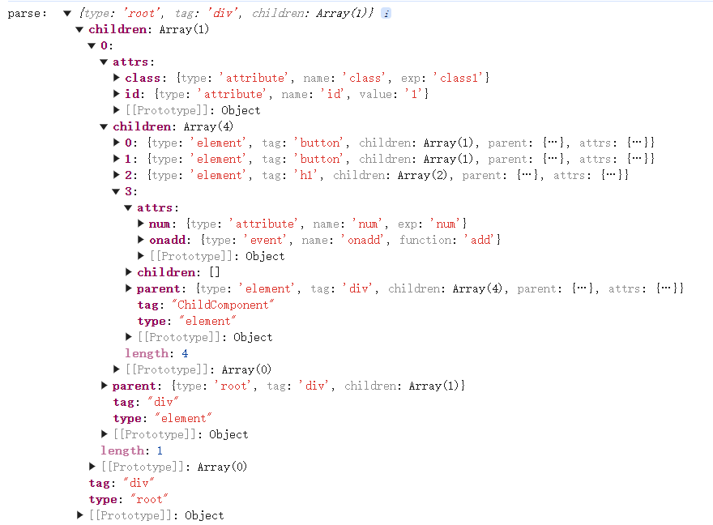
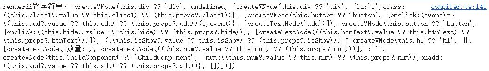

# Vue原理深度剖析：渲染管线-编译

## 前言

在深入了解Vue的编译阶段之前，建议先阅读[Vue官方文档的渲染机制](https://cn.vuejs.org/guide/extras/rendering-mechanism.html)部分。Vue的渲染管线主要包含三个阶段：**编译**、**挂载**和**更新**。本文将重点讲解编译阶段的工作原理。

## 1. 虚拟DOM概述

在探讨Vue模板编译之前，我们需要先理解虚拟DOM的概念，因为它是模板编译的最终目标。

### 1.1 什么是虚拟DOM？

虚拟DOM是使用JavaScript对象来模拟真实DOM树的一种技术，它通过JS对象表示DOM节点及其关系。

### 1.2 为什么需要虚拟DOM？

想象一下，如果你是一位城市规划师：

- **真实城市**（真实DOM）的改造成本极高 — 拆一栋楼、拓一条路都需要大动干戈，还会影响居民生活
- **虚拟DOM**就像你桌上的沙盘模型：
  1. 先在沙盘上自由修改：挪动建筑、拓展街道，试错成本极低
  2. 修改完成后，对比新旧沙盘，只标记出"必须改动的地方"
  3. 最后按照清单在实际城市中进行有针对性的改造，其他区域保持不变

这种方式避免了对真实DOM的频繁操作，提高了性能和效率。

## 2. 模板编译流程

模板编译的最终目的是输出一个能生成虚拟DOM树的**render渲染函数**。整个编译过程可以概括为：

```
模板 → AST语法树 → render渲染函数
```

这个过程包含两个主要阶段：
- **Parse阶段**：将模板解析成AST语法树
- **Generate阶段**：将AST语法树转换成render渲染函数

值得注意的是，Vue3在编译时引入了一些优化机制，如对AST树进行优化标记，但本文将聚焦于基本编译流程的讲解。

## 3. AST抽象语法树

### 3.1 AST的本质

AST（抽象语法树）可以理解为"所有语言的通用骨架"。不仅Vue模板需要它，JavaScript、Python甚至自然语言都可以用AST来表示其结构。

以自然语言为例，中文有"主谓宾"的基本结构（如"我吃饭"）。无论句子多复杂，如"我吃了一碗香喷喷的米饭"或"他昨天在餐厅吃牛排"，其核心结构都是"谁 + 做 + 什么"。

AST的作用就是提取这种核心结构：

- 在JavaScript中，无论是`let a = 1 + 2`还是`const b = (3 * 4) / 5`，AST都能提炼出"声明变量→赋值→运算"的核心结构
- Babel能将高版本JS转为低版本，正是因为它先将代码解析为AST，再按低版本语法重新构建
- Vue模板中的`<div @click="fn">text</div>`，通过AST会被解析为"标签类型→事件绑定→文本内容"的结构

简言之，AST就像语言的"X光片"，能透视出表面文字下的核心结构，让计算机理解"这段代码在做什么"。

### 3.2 AST节点设计

AST节点设计需要考虑以下因素：

- **节点类型(type)**：ROOT(根元素)、ELEMENT(元素)、TEXT(文本)、INTERPOLATION(插值表达式)
- **节点属性(attrs)**：ATTRIBUTE(普通属性)、DIRECTIVE(指令)、EVENT(事件)
- **子节点(children)**：可以包含元素、文本、插值等子节点
- **父节点(parent)**：建立父子关系的双向映射，便于回溯查找

以下是模拟的AST节点的典型结构：

```js
{
    type: TYPE.ELEMENT|TYPE.TEXT|TYPE.INTERPOLATION,
    tag: 'div',  // type为ELEMENT元素时存在
    attrs:{  // type为ELEMENT元素时存在
        '属性名':{
            name:'属性名',
            type:TYPE.ATTRIBUTE|TYPE.DIRECTIVE|TYPE.EVENT,
            value:'静态属性值', // 静态值都统一用value，动态值用exp
            exp:'动态属性值', 
            function:'事件方法', // type为EVENT事件时存在
        },
    }, 
    value: '静态属性值',  
    exp:'动态属性值',  
    children:[], // type为ELEMENT元素时存在
    parent:parent,
}
```

## 4. Parse阶段详解

Parse阶段的主要任务是解析模板字符串，识别不同类型的节点（开始标签、结束标签、文本节点、插值节点等），并根据各自的处理逻辑构建AST树。

### 4.1 Parse阶段的核心流程

Parse阶段的核心是通过正则表达式识别不同类型的节点，并构建AST树。主要步骤包括：

1. 初始化根节点
2. 使用正则表达式识别模板中的标签、属性和插值表达式
3. 根据不同节点类型（开始标签、结束标签、文本、插值）执行相应的处理逻辑
4. 维护当前节点的状态，建立节点之间的父子关系

### 4.2 代码模拟实现


```js
// compile.js
const TYPE =  {
    ROOT : 'root',
    ELEMENT :'element',  // 元素
    TEXT : 'text',  // 文本
    INTERPOLATION : 'interpolation',  // 插值
    DIRECTIVE : 'directive',  // 指令
    ATTRIBUTE : 'attribute',  // 属性
    EVENT : 'event' //事件
}
export const parse = function (template) {
  const root = { type: TYPE.ROOT, tag: 'div', children: [] }
  let current = root
  template = template.trim()
  // 开始标签正则
  const startTagReg = /<(\w+)([^>]*)(\/?)>/
  // 结束标签正则
  const endTagREg = /<\/(\w+)>/
  // 插值正则
  const interReg = /{{([^}]+)}}/
  let i = 0
  while (i < template.length) {
    const tempStr = template.slice(i)
    if (template[i] === '<') {
      const startMatch = tempStr.match(startTagReg)
      // 先判定是否是结束标签，结束标签重要逻辑是回到父级，不需要新增节点
      if (template[i + 1] === "/") {
        const endMatch = tempStr.match(endTagREg)
        // 如果结束标签和当前标签不匹配，或者没有父节点，抛出异常
        if (endMatch[1] !== current.tag || !current.parent) {
          throw new Error('模板不合法')
        } else {
          current = current.parent
          i = i + endMatch[0].length
        }
      } else if (startMatch) {
        // 开始标签。重要逻辑是添加节点，节点类型是元素
        const obj = {
          type: TYPE.ELEMENT,
          tag: startMatch[1],
          children: [],
          parent: current // 保持对父节点的引用
        }
        obj.attrs = getAttributes(startMatch[2])
        // 自结束标签
        if (startMatch[3]) {
          obj.isCloseSelf = true
        }
        // 添加节点，父子节点建立双向映射
        current.children.push(obj)
        // 更新当前操作节点
        current = obj
        i = i + startMatch[0].length
      } else {
        throw new Error('模板不合法')
      }
    } else if (template[i] === '{' && template[i + 1] === '{') {
      // 文本差值，重要逻辑是添加节点，节点类型是插值,没有子节点
      const interMatch = tempStr.match(interReg)
      if (interMatch) {
        const obj = {
          type: TYPE.INTERPOLATION,
          exp: interMatch[1].trim(),
          parent: current
        }
        current?.children?.push(obj)
      } else {
        throw new Error('模板不合法')
      }
      i = i + interMatch[0].length
    } else {
      // 普通文本，重要逻辑是添加节点，节点类型是文本,没有子节点
      // 找到下一个标签或者插值位置
      const aIndex = tempStr.indexOf('<')
      const bIndex = tempStr.indexOf('{{')
      const temp = (aIndex >= 0 && bIndex >= 0) ? Math.min(aIndex, bIndex) : Math.max(aIndex, bIndex)
      if (temp < 0) {
        throw new Error('模板不合法')
      }
      const text = template.slice(i, i + temp).trim()
      if (text) {
        const obj = {
          type: TYPE.TEXT,
          value: text,
          parent: current
        }
        current?.children?.push(obj)
      }
      i = i + temp
    }
  }
  console.log("parse：", root)
  return root
}
// 获取节点属性
const getAttributes = function (attrStr) {
  if (!attrStr) return
  const resultObj = {}
  const regex = /([^=\s]+)=?("([^"]*)"|'([^']*)')?/g;
  let match;
  while ((match = regex.exec(attrStr)) !== null) {
    let [name, _1, _2, _3] = match.slice(1);
    let value = (_3 || _2 || _1).trim()
    name = name?.trim()
    if (name.startsWith("@")) {
      // 事件     
      resultObj['on' + name.substring(1)] = {
        type: TYPE.EVENT,
        name: 'on' + name.substring(1),
        function: value
      }
    } else if (name.startsWith("v-")) {
      // 指令
      resultObj[name] = {
        type: TYPE.DIRECTIVE,
        name: name,
        exp: value
      }
    } else if (name.startsWith(":")) {
      // 动态属性
      resultObj[name.substring(1)] = {
        type: TYPE.ATTRIBUTE,
        name: name.substring(1),
        exp: value
      }
    } else {
      // 普通属性
      resultObj[name] = {
        type: TYPE.ATTRIBUTE,
        name,
        value
      }
    }
  }
  return resultObj
}
```

### 4.3 应用示例

下面是一个模板编译的示例：

```js
const template = `
 <div id="1" :class="class1">
   <button  @click="add">add</button>
   <button  @click="hide">{{btnText}}</button>
   <h1 v-if="isShow">数量:{{ num }}</h1>   
   <ChildComponent :num="num" @add="add"></ChildComponent>
 </div>
 `
const ast = parse(template)
```

解析后的AST结构如下图所示：



## 5. 虚拟DOM创建函数

在讲解Generate阶段之前，我们需要了解两个关键函数：`createVNode`和`createTextNode`，它们是生成虚拟DOM的基础。

### 5.1 createVNode函数

`createVNode`函数用于创建虚拟DOM节点，接收三个参数：标签名、属性对象和子节点数组。

```js
// help.js
createVNode(tag, props, childrens) {
    return {
      tag,  // tag可以是普通dom标签，也可以是组件
      props,
      childrens,
      el: null, // 预留属性,真实的dom节点，虚拟dom和真实dom建立映射，如果tag为普通dom标签时存在，
      component: null  // 组件实例，虚拟dom与组件建立映射，如果tag为组件时存在，预留属性
    }
  },
```

### 5.2 createTextNode函数

`createTextNode`函数用于创建文本节点，这里模拟较为简单，直接返回文本内容：

```js
// help.js
createTextNode(value) {
    return value
  },
```

## 6. Generate阶段详解

Generate阶段的核心任务是将AST抽象语法树转换为render渲染函数。

### 6.1 Generate阶段的目标

render函数的作用是生成虚拟DOM树，例如：

```js
function render(){
   return createVNode('div',{id:1,class:'red'},[createTextNode('我是div')])      
}
```

由于render函数的内容是根据AST动态生成的，我们需要通过字符串拼接来构建函数体，最后使用`new Function()`将字符串转换为实际的函数：

```js
const funcStr = `
  return createVNode('div',{id:1,class:'red'},[createTextNode('我是div')])      
`
const render = new Function('createVNode','createTextNode',funcStr)
```

### 6.2 处理动态值

模板中的动态值需要与组件实例的数据正确关联。下面是获取动态值的辅助函数：

```js
// 获取动态值的字符串,这里不考虑表达式的情况
const getExpStr = function (exp) {
    // 从当前作用域下取值，考虑值为ref的情况
    const thisExp = `(this.${exp}?.value ?? this.${exp})`;
    // 从props里取值,在vue里，会把props封装成reactive对象
    const propExp = `(this.props?.${exp})`
    // 优先取当前作用域下的值，最后是props的值    
    return `(${thisExp} ?? ${propExp})`;
}
```

### 6.3 代码模拟实现

Generate阶段的完整代码实现如下：

```js
export const generate = function (ast) {
    // 递归处理ast
    const resultStr = digui(ast)
    console.log("render函数字符串：", resultStr)
    // 把字符串转成真实的函数
    const render = new Function('createVNode', 'createTextNode', 'return ' + resultStr)
    return render
}
function digui(obj) {
    let str = ''
    // 对于不同的type，处理逻辑不同，文本和插槽比较简单，创建一个文本虚拟dom即可；
    // ELEMENT比较复杂，需要拼接子节点字符串，属性字符串，而属性还包括指令的处理(这里只简单模拟v-if)
    switch (obj.type) {
        case TYPE.ROOT:
        case TYPE.ELEMENT:
            // 拼接子节点字符串
            let childStr = obj?.children?.map((child, i) => digui(child, i)).join(', ')
            childStr = childStr ? `[${childStr}]` : '[]'            
            // 获取属性字符串
            const attrsStr = getPropsStr(obj)
            // 获取tag字符串
            const tagStr = getTag(obj.tag)
            // 指令处理
            if (obj.attrs?.['v-if']) {
                // v-if指令 
                // 获取指令的值
                const v = getExpStr(obj.attrs['v-if'].exp)
                // 如果值为true才创建虚拟dom，否则返回空字符
                str += `(${v}) ? createVNode(${tagStr}, ${attrsStr}, ${childStr}) : ''`
            } else {
                // 无指令的普通情况
                str += `createVNode(${tagStr}, ${attrsStr}, ${childStr})`
            }
            break;
        case TYPE.TEXT:
            str += `createTextNode('${obj.value}')`
            break;
        case TYPE.INTERPOLATION:
            str += `createTextNode(${getExpStr(obj.exp)})`
            break;
    }
    return str
}
// 获取属性字符串
const getPropsStr = function (obj) {
    const attrs = obj?.attrs
    if (!attrs) return
    let returnStr = ''
    Object.values(attrs).forEach((attr) => {
        if (!attr.name) return
        // 属性
        if (attr.type === TYPE.ATTRIBUTE) {
            if (attr.exp) {
                // 动态属性
                returnStr += `${attr.name}:${getExpStr(attr.exp)},`
            } else {
                // 普通属性
                returnStr += `${attr.name}:'${attr.value}',`
            }
        } else if (attr.type === TYPE.EVENT) {
            //事件
            const match = attr.function.match(/(.+)\((.*)\)/)
            // 如果事件处理器有传递参数，需要特殊处理
            let args = match?.[2].trim()
            if (args) {
                // 参数的最后追加event
                args = args ? `${args},event` : 'event'
                const funName = match?.[1]
                returnStr += `${attr.name}:(event)=>this.${funName}(${args}),`
            } else {
                returnStr += `${attr.name}:this.${attr.function},`
            }
        } else {
            // 其他指令 暂不模拟
        }
    })
    if (returnStr.endsWith(",")) {
        returnStr = returnStr.substr(0, returnStr.length - 1)
    }
    returnStr = `{${returnStr}}`
    return returnStr
}
// 获取动态值的字符串
const getExpStr = function (exp) {
    // 从当前作用域下取值，考虑值为ref的情况
    const thisExp = `(this.${exp}?.value ?? this.${exp})`;
    // 从props里取值,在vue里，会把props封装成reactive对象
    const propExp = `(this.props?.${exp})`
    // 优先取当前作用域下的值，最后是props的值    
    return `(${thisExp} ?? ${propExp})`;
}

// 获取tag字符串
// tag可以是普通dom，也可以是组件
// 组件需要注册，但在组合式写法里，组件通过setup返回，模版中即可使用。
// 我们这里假设组件通过setup返回后和data一样，直接挂在this下
const getTag = function (tag) {
    return `this.${tag} ?? '${tag}'`
}
```

### 6.4 应用示例

下面是一个模板编译的示例：

```js
const template = `
 <div id="1" :class="class1">
   <button  @click="add(1)">add</button>
   <button  @click="hide">{{btnText}}</button>
   <h1 v-if="isShow">数量:{{ num }}</h1>   
   <ChildComponent :num="num" @add="add"></ChildComponent>
 </div>
 `
const ast = parse(template)
generate(ast)
```
生成结果如下：


## 7. 总结

本文详细介绍并模拟了Vue渲染管线中的编译过程，主要包括以下几个关键部分：

1. **虚拟DOM的概念与优势**：虚拟DOM作为真实DOM的轻量级JavaScript表示，通过抽象DOM操作提高了性能和跨平台能力。

2. **模板编译流程**：Vue将模板编译为渲染函数的过程分为三个主要阶段：
   - Parse阶段：将模板字符串解析为AST（抽象语法树）
   - Transform阶段：对AST进行优化和转换（本文暂未涉及）
   - Generate阶段：将AST转换为可执行的渲染函数

3. **AST的核心作用**：AST作为编译过程的中间表示，是连接模板和渲染函数的桥梁，为后续的代码生成和优化提供了基础。

4. **Parse阶段的实现**：通过词法分析和语法分析，将模板解析为结构化的AST节点，包括元素节点、文本节点和插值表达式等。

5. **虚拟DOM创建函数**：`createVNode`和`createTextNode`函数是构建虚拟DOM树的基础，用于创建不同类型的虚拟节点。

6. **Generate阶段的代码生成**：将AST转换为渲染函数字符串，并处理动态属性、事件和指令等特性。

通过这一系列的编译步骤，模拟实现了从声明式模板到命令式渲染函数的转换，为高效的DOM更新和渲染提供了基础。这种编译策略不仅提高了运行时性能，还为后续的编译优化（如静态提升、树结构打平等）奠定了基础。

