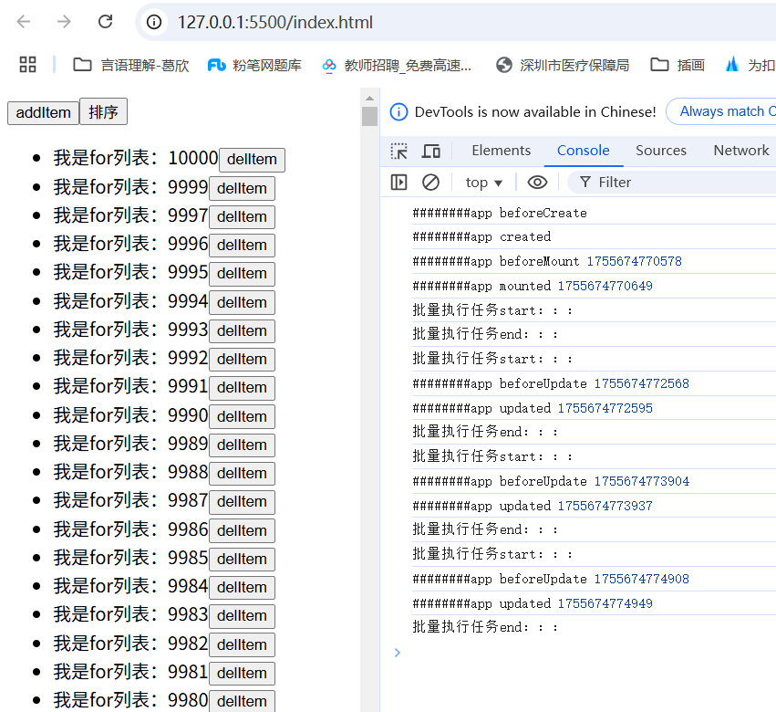
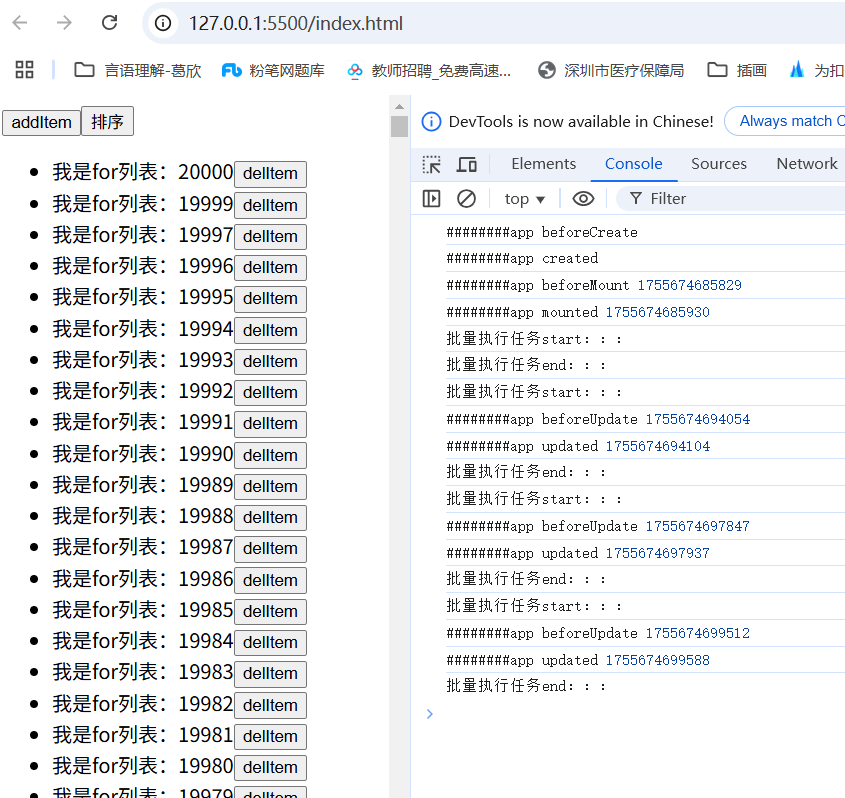

# vue3编译优化-更新类型标记
在vue官方文档[渲染机制](https://cn.vuejs.org/guide/extras/rendering-mechanism#compiler-informed-virtual-dom)有提到，Vue 编译阶段做了一些优化，让生成的虚拟 DOM带上编译时信息，以此来提高运行时的性能，具体优化有：更新类型标记，静态节点缓存，树结构打平。这些工作都是在transform转换阶段完成，也就是parse之后，generate之前
- 更新类型标记：运行阶段重点关注的是那些动态的元素，响应式数据更新后，就要生成新的虚拟dom，新旧虚拟dom树进行diff对比等等，那如果说提前就标记好你的改动有哪些，明确目标后再开始针对性的行动，class需要更新，我们就针对性的更新class，样式要更新我们就针对性的更新样式，目标明确任务执行起来要轻松不少
- 静态节点缓存：静态节点表示它永远不会更新，那么也就没有必要生成新的虚拟dom去进行diff对比，所以可以缓存起来重复使用
- 树结构打平：打平之后就是个简单的数组，只需要做遍历即可，而树结构需要做递归，遍历和递归的复杂性及性能消耗区别不言而喻

## 更新类型标记
### 分析
vue中对不同的更新做了不同的标记，如：
```js
const PatchFlags = {
    // 特殊标记：静态节点
    HOISTED: -1,
    // 0b00000001 - 动态文本内容（如{{ msg }}）
    TEXT: 1,
    // 0b00000010 - 动态class绑定（如:class="{ active }"）
    CLASS: 1 << 1,    // 2
    // 0b00000100 - 动态style绑定（如:style="styles"）
    STYLE: 1 << 2,    // 4
    // 0b00001000 - 动态props（非class/style的普通属性）
    PROPS: 1 << 3,   // 8
    // 0b10000 -动态子节点
    CHILDREN: 1 << 4,    //16
    // 0b100000 动态事件
    HYDRATE_EVENTS: 1 << 5,  //32
    // 0b1000000 动态指令
    DYNAMIC_DIRECTIVES: 1 << 6  //64
    // ...
}
```
更新可能不仅仅是一项，而是多项，vue采用的位运算来表示多项更新，这样的方式可以做到用一个变量就标识多项变化的效果，如：
```js
const patchFlags = PatchFlags.TEXT | PatchFlags.CLASS  //  0b00000011 也就是3
// 判断更新类型
if (patchFlags & PatchFlags.TEXT) {
  // 说明有动态文本
}
if (patchFlags & PatchFlags.CLASS) {
  // 说明有动态class
}
```

### 代码模拟实现
```js
// compiler.js
const PatchFlags = {
    // 特殊标记：静态节点
    HOISTED: -1,
    // 0b00000001 - 动态文本内容（如{{ msg }}）
    TEXT: 1,
    // 0b00000010 - 动态class绑定（如:class="{ active }"）
    CLASS: 1 << 1,    // 2
    // 0b00000100 - 动态style绑定（如:style="styles"）
    STYLE: 1 << 2,    // 4
    // 0b00001000 - 动态props（非class/style的普通属性）
    PROPS: 1 << 3,   // 8
    // 0b10000 -动态子节点
    CHILDREN: 1 << 4,    //16
    // 0b100000 动态事件
    HYDRATE_EVENTS: 1 << 5,  //32
    // 0b1000000 动态指令
    DYNAMIC_DIRECTIVES: 1 << 6  //64
    // ...
}
const markPatchFlag = function (ast) {
    // 如果节点类型是元素
    if (ast.type === TYPE.ELEMENT) {
        ast.patchFlag = 0
        for (let key in ast.attrs) {
            const value = ast.attrs[key]
            // 动态事件
            if (value.function) {
                ast.patchFlag |= PatchFlags.HYDRATE_EVENTS
            }
            if (value.exp) {
                // 动态指令
                if (value.type === TYPE.DIRECTIVE) {
                    ast.patchFlag |= PatchFlags.DYNAMIC_DIRECTIVES
                } else if (value.type === TYPE.ATTRIBUTE) {
                    // 动态class
                    if (value.name === 'class') {
                        ast.patchFlag |= PatchFlags.CLASS
                    } else if (value.name === 'style') {
                        // 动态样式
                        ast.patchFlag |= PatchFlags.STYLE
                    } else {
                        // 动态属性
                        ast.patchFlag |= PatchFlags.PROPS
                        // 收集动态属性
                        if (!ast.dynamicProps) {
                            ast.dynamicProps = []
                        }
                        ast.dynamicProps.push(key)
                    }
                }
            }
        }
    } else if (ast.type === TYPE.INTERPOLATION) {
        // 动态文本
        ast.parent.patchFlag |= PatchFlags.TEXT
    }
    // 处理子节点
    ast.children?.forEach((child) => {
        const childPathcFlag = markPatchFlag(child)
        if (childPathcFlag && childPathcFlag !== PatchFlags.HOISTED) {
            ast.patchFlag |= PatchFlags.CHILDREN
        }
    })
    // 该节点为静态节点
    if (ast.patchFlag === 0) {
        ast.patchFlag = PatchFlags.HOISTED
        ast.isDynamic = false
    } else if (ast.patchFlag) {
        ast.isDynamic = true
    }
    return ast.patchFlag
}
// digui函数有调用createVNode函数的地方，需增加一个参数patchFlag
function digui(obj) {   
   //...
    if (obj.attrs?.['v-if']) {
        // v-if指令 
        // 获取指令的值
        const v = getExpStr(obj.attrs['v-if'].exp)
        // 如果值为true才创建虚拟dom，否则返回空字符
        str += `(${v}) ? createVNode(${tagStr}, ${attrsStr}, ${childStr},${obj.patchFlag}) : ''`
    } else {
        // 无指令的普通情况
        str += `createVNode(${tagStr}, ${attrsStr}, ${childStr},${obj.patchFlag})`
    }   
    //...
}
// getPropsStr函数也要增加处理动态属性的逻辑
const getPropsStr = function (obj) {
    // ...
  // 动态属性处理
    if(obj.dynamicProps?.length > 0){
        returnStr += `$dynamicProps:${JSON.stringify(obj.dynamicProps)},`
    }   
    Object.values(attrs).forEach((attr) => {
        // ...
    })
    // ...
}

```

```js
// help.js
// createVNode函数也有所调整，返回对象增加patchFlag、$dynamicProps属性
 createVNode(tag, props = {}, childrens, patchFlag) {
    const { $dynamicProps, ...cleanProps } = props;
    return {
      tag,  // tag可以是普通dom标签，也可以是组件
      props: cleanProps,
      childrens,
      el: null, // 真实的dom节点，如果tag为普通dom标签时存在，预留属性
      component: null, // 组件实例，如果tag为组件时存在，预留属性
      patchFlag,  // 动态更新标记
      $dynamicProps: props?.$dynamicProps || [],  // 动态属性
    }
  },
```

### 应用
```js
// compiler.js
export const tranform = function (ast) {
    // 更新类型标记
    markPatchFlag(ast)    
}
```

```js
// runtime.js
const createComponentIntance = function (component, props, _instance) {
    //...
    // 编译模板
    if (!render && template) {
        const ast = parse(template)
        // 转化ast，进行优化操作
        tranform(ast)
        renderFun = generate(ast)
    }
    //...
}
const commonMount = function ({ instance, parentDom, insertIndex }) {
    // ...
            // render函数的调用不再需要传递参数
            const vnode = instance.render();
    // ...
        
    }
export const update = function (componentInstance) {
   // ...
    // render函数的调用不再需要传递参数
    const newVnode = componentInstance.render()
   //...
}

// 新的diff函数
// 参数1:旧的Vnode树
// 参数2:新的Vnode树
// 参数3:父节点
// 参数4:在父节点中插入的位置
const diff = function (oldVnodeTree, VnodeTree, parentDom, insertIndex) {
    // 节点相同不需要对比，直接返回
    if (oldVnodeTree === VnodeTree) {        
        return
    }    
    if (!isSameVNodeType(oldVnodeTree, VnodeTree)) {
        // 1. 如果节点不是同类型，直接删除创建新节点
        // 删除旧节点
        (parentDom || dom.parentElement).removeChild(dom)
        // 创建新节点
        mount({ vnode: VnodeTree, parentDom, insertIndex })
        return
    } else {
        const dom = oldVnodeTree.el
        // 动态文本
        if (oldVnodeTree.patchFlag & PatchFlags.TEXT) {
            const newText = VnodeTree.childrens.join("")
            const oldText = oldVnodeTree.childrens.join("")
            if (oldText !== newText) {
                dom.innerText = newText
            }            
        }
        // dom属性有更新
        const oldProps = oldVnodeTree.props
        const newProps = VnodeTree.props
        // 动态class
        if (oldVnodeTree.patchFlag & PatchFlags.CLASS) {
            if (oldProps.class !== newProps.class) {
                typeof VnodeTree.tag === 'object' ? dom.props.class = newProps.class : dom.setAttribute('class', newProps.class)
            }
        }
        // 动态样式
        if (oldVnodeTree.patchFlag & PatchFlags.STYLE) {
            const newStyle = VnodeTree.props.style
            for (let styleK in newStyle) {
                if (dom.style[styleK] !== newStyle[styleK]) {
                    typeof VnodeTree.tag === 'object' ? (dom.props.style[styleK] = newStyle[styleK]) : (dom.style[styleK] = newStyle[styleK])
                }
            }
        }
        // 动态属性
        if (oldVnodeTree.patchFlag & PatchFlags.PROPS) {
            // 只遍历动态属性，非动态的不处理
            const dynamicProps = oldVnodeTree.$dynamicProps
            dynamicProps.forEach((k) => {
                if (oldProps[k] !== newProps[k]) {
                    const v = newProps[k]
                    typeof VnodeTree.tag === 'object' ? (dom.props[k] = v) : dom.setAttribute(k, v)
                }
            })
        }
        if (oldVnodeTree.patchFlag & PatchFlags.HYDRATE_EVENTS) {
            // 在目前我们模拟的情况下，事件处理函数不会变化，所以这里暂不写逻辑
        }
        if (oldVnodeTree.patchFlag & PatchFlags.DYNAMIC_DIRECTIVES) {
            // 在目前我们模拟的情况下，只实现了v-if指令，这个指令的逻辑在generate时就处理过了，所以这里暂不写逻辑
        }

       // 设置vnode与dom或者组件的映射关系
        setVnodeDomMap({ vnode: VnodeTree, el: oldVnodeTree.el, component: oldVnodeTree.component })
        // 处理子节点
        if (oldVnodeTree.patchFlag & PatchFlags.CHILDREN) {
            diffChildren(oldVnodeTree.childrens || [], VnodeTree.childrens || [], oldVnodeTree.el)
        }
    }

}  
```
```js
// appComponent.js
 // ...
 // 把列表数据改足够大
const array = new Array(10000).fill(0).map((i, k) => {
    return { id: k, text: k }
}).reverse()
const sort = () => {
    items.sort((item1, item2) => {
    return item2.id - item1.id
    })
}
```
### 执行结果
列表数据10000条情况下，挂载、点击列表添加、删除、排序按钮的结果表现：


列表数据20000条表现：


可以看到时间数据比之前好太多了，效果非常明显