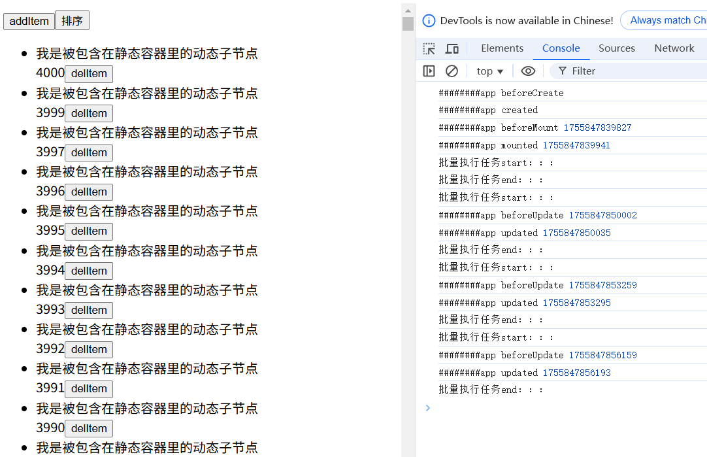
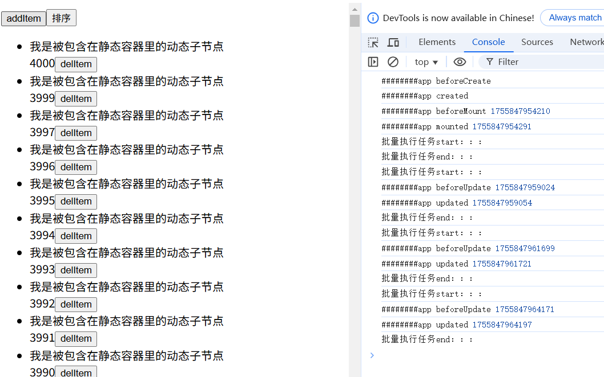
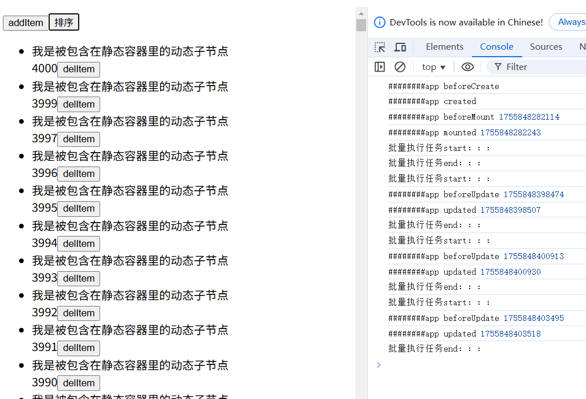

# vue编译优化_静态缓存
上篇文章我们做了动态标记优化，性能提升明显，这篇文章我们继续来做静态节点缓存优化
做静态节点缓存优化的核心思想：
静态节点不会变化，所以可以缓存起来，后续渲染时直接使用缓存的节点，避免重复创建节点
而静态节点又还分成两种情况：
1. 完全的纯静态节点，可以直接用innerHtml插入，如：<p>123</p>
2. 包含动态子节点的静态容器，本身是静态的，但是子节点是动态的。如：<p><span>{{text}}</span></p>。其中span是动态子节点，而p节点本身是不变的
下面分别对这两种情况进行分析处理

## 纯静态节点缓存

### 分析
静态节点有更加简单直接的插入方式，就是innerHtml，如果还有很多的子节点，都统一用innerHtml方式插入，都不用递归处理了
怎么缓存静态节点以便重复使用呢？
1. **新增静态虚拟节点的创建方式**:创建方式createStaticNode，接收参数content，也就是模版字符串
2. **提取静态节点**: 如果节点为静态节点，将节点序列化为模板字符串，存放到变量列表里;同时ast节点设置索引属性，与变量列表项建立关联

3. **生成静态虚拟节点变量**:生成render函数内容前，遍历变量列表，根据索引生成变量名，变量提升到render函数之外
4. **变量替换**:render函数生成时，用变量名替换createStaticNode

### 代码模拟实现
```js
// help.js
 // 1.新增静态节点虚拟dom的创建方式createStaticNode
  createStaticNode(content) {
    return {
      isStatic: true, // 是否是静态节点标识
      el: null, // 真实的dom节点
      props: {}, // props为空对象
      // content, // 模版字符串
      // 这里用mount函数代替简单的content属性，以便做一些逻辑处理
      mount: (() => {  // 使用闭包的方式缓存真实dom
        let cachedDom
        return function (parentDom, insertIndex) {
          let dom
          // 如果有缓存，直接克隆缓存的dom
          if (cachedDom) {
            // 缓存的dom需要深拷贝，不然v-for列表下每一项的静态节点都会共用一个真实dom
            dom = cachedDom.cloneNode(true)
          } else {
            const div = document.createElement('div')
            div.innerHTML = content
            dom = div.childNodes[0]
            cachedDom = dom
          }
          // 插入节点
          if (typeof insertIndex !== 'number' || insertIndex >= parentDom.childNodes.length) {
            parentDom.appendChild(dom)
          } else {
            const refNode = parentDom.childNodes[insertIndex]
            parentDom.insertBefore(dom, refNode)
          }
          // 虚拟dom和真实dom绑定
          this.el = dom
        }
      })()
    }
  },
// ...
```

```js
// compiler.js
// ...
// 2. 如果ast节点为静态节点，将静态节点序列化为模板字符串，存放到变量列表里;同时ast节点设置索引属性，与变量列表项建立关联

let hoistedList = []
const staticNodeCache = function (ast) {
    // 判断是否是静态节点
    if (!ast.isDynamic && ast.patchFlag === PatchFlags.HOISTED) {
        ast.isStatic = true
        // 将静态节点序列化为模板字符串，存放到列表里
        hoistedList.push(serializeNode(ast))
        // ast节点设置索引属性，与模版字符串建立关联
        ast.hoistedIndex = hoistedList.length - 1
    } else if (ast.children && ast.children.length > 0) {
        // 递归处理子节点
        ast.children.forEach((child) => {
            staticNodeCache(child)
        })
    }
}
// 将静态节点序列化为模板字符串
const serializeNode = function (ast) {
    // 文本节点直接返回
    if (ast.type === TYPE.TEXT) {
        return ast.value
    }
    // 处理属性
    const propsArray = []
    for (let k in ast.attrs) {
        const v = ast.attrs[k]?.value
        propsArray.push(`${k} = "${v}"`)
    }
    const propsStr = propsArray.join(" ")
    if (ast.isCloseSelf) {
        return `<${ast.tag} ${propsStr}/>`
    } else {
        // 处理子节点
        let childrenArray, childrenStr = ''
        if (ast.children) {
            childrenArray = ast.children.map((child) => {
                return serializeNode(child)
            })
            childrenStr = childrenArray.join("")
        }
        return `<${ast.tag} ${propsStr}>${childrenStr}</${ast.tag}>`
    }
}
// 3. 生成render函数内容前，遍历列表，根据索引生成变量名，变量提升到render函数之外
export const generate = function (ast) {
    // 生成静态节点变量声明
    const hoistedDeclarations = hoistedList.map((item, i) => {
        return `const _hoisted_${i} = createStaticNode('${item}')`
    }).join(';\n')
    // 重置静态节点列表
    hoistedList = []
    // 递归处理ast
    const resultStr = digui(ast)
    // 把字符串转成真实的函数
    // 把变量提取到render函数之外
    // 这里的render函数写法要注意不要用箭头函数，不然上下文this会有问题
    const funcStr = `
        ${hoistedDeclarations}
        const render = function(){
           return ${resultStr}
        }
        return render
    `
    const func = new Function('createVNode', 'createTextNode', 'createStaticNode', funcStr)
    const renderFunc = func(h.createVNode,h.createTextNode,h.createStaticNode)    
    return renderFunc
}
// 4. render函数生成时，用变量名替换createStaticNode
function digui(obj) {
    let str = ''
    if (obj.isStatic) {
        // 根据索引得到变量名
        str += `_hoisted_${obj.hoistedIndex}`
    } else {
        // 其他原代码
        // ...
    }
    return str
}
```
## 静态容器节点缓存 

### 分析
静态容器节点特点是：本身是静态的，子节点是动态的。所以节点本身可以缓存复用，但是子节点需要动态获取
怎么做到节点本身缓存，子节点动态获取？
1. 静态容器节点缓存的处理跟纯静态节点缓存类似，但创建使用的方法不是createStaticNode，而是createVNode

2. 子节点childrens为计算函数，每次渲染的时候，都得调用这个函数，获取最新的子节点
3. 静态容器可以是嵌套的，所以childrens计算函数里又可能引用静态容器变量，因此静态容器变量的申明需要注意顺序，子容器变量先申明，父容器变量后申明
4. v-for会开启局部作用域，目前是通过闭包的方式访问局部作用域。但是静态容器提升成了全局作用域，v-for下的静态容器的子节点想访问局部作用域的数据会访问不到
因此v-for下的静态容器不能做变量提升缓存
### 模拟实现
```js
// compiler.js
// 静态容器节点缓存的处理跟纯静态节点缓存类似
// 静态容器节点缓存列表：本身是静态，但有动态子节点
let hoistedContainerList = []
// v-for指令下的静态容器不要提升变量缓存！！！
// 用栈存储v-for指令
const vforStack = []
const staticContainerNodeCache = function (ast) { 
    // 入栈   
    if (ast.attrs?.['v-for']) {
        vforStack.push(ast)
    }
    if (ast.patchFlag === PatchFlags.CHILDREN) {       
        // v-for栈为空，则不在v-for指令下
        if (vforStack.length === 0) {
            hoistedContainerList.push(ast)
            // 缓存静态容器节点的索引,这样静态容器节点和变量才可以关联起来
            ast.hoistedContainerIndex = hoistedContainerList.length - 1
        }
    }
    if (ast.children && ast.children.length > 0) {
        // 递归处理子节点
        ast.children.forEach((child) => {
            staticContainerNodeCache(child)
        })
    }
    // 出栈
    if (ast.attrs?.['v-for']) {
        vforStack.pop()
    }
}
export const tranform = function (ast) {
    // 更新类型标记
    markPatchFlag(ast)
    // 静态缓存
    staticNodeCache(ast)
    staticContainerNodeCache(ast)
}
```
```js
// compiler.js
// 生成变量声明语句
export const generate = function (ast) {
    // ...
    // 生成静态容器节点变量声明
    const hoistedContainerDeclarations = getHoistedContainerDeclarations()
    hoistedContainerList = []
    // ...
    const funcStr = `
        ${hoistedDeclarations}
        ${hoistedContainerDeclarations}
        const render = function(){
           return ${resultStr}
        }
        return render
    `
    // ...
}
function getHoistedContainerDeclarations() {
    let containerDeclarations = ''
    // 需要倒序遍历，子容器节点变量申明后，父容器节点才能使用该变量作为子节点
    for (let i = hoistedContainerList.length - 1; i >= 0; i--) {
        const node = hoistedContainerList[i]
        const attrsStr = getPropsStr(node)
        const tagStr = getTag(node.tag)
        const childrenStr = getChildrenStr(node)
        const declaration = `const _hoisted_container_${i} = createVNode(${tagStr},${attrsStr},${childrenStr},${node.patchFlag});`
        containerDeclarations += declaration
    }
    return containerDeclarations
}
function getChildrenStr(node) {
    let childrenStr = ''

    // 所有直接子节点都是静态的（这个静态包括静态容器）
    let allChildStatic = true
    childrenStr = node?.children?.map(child => {
        if (child.patchFlag === PatchFlags.CHILDREN && child.hoistedContainerIndex !== undefined) { // 增加判断：hoistedContainerIndex不为undefined
            // 如果是静态容器
            return `_hoisted_container_${child.hoistedContainerIndex}`
        } else if (child.isStatic) {
            // 如果是静态节点
            return `_hoisted_${child.hoistedIndex}\n`
        } else {
            allChildStatic = false
            // 动态节点
            const vnode = digui(child)
            return vnode
        }

    }).join(',') || `[]`

    const isAlreadyArray = /^this\..*\.map/.test(childrenStr) || childrenStr.startsWith('[');
    if (!isAlreadyArray) {
        childrenStr = `[${childrenStr}]`
    }
    // 如果有动态子节点，返回计算函数;
    if (allChildStatic) {
        return childrenStr
    } else {
        return `function(){
            return ${childrenStr}
        }`
    }
}
// 递归过程中，同样还会遇到静态容器和静态节点，用变量名替换
function digui(obj) {
    let str = ''
    if (obj.isStatic) {
        // 静态节点
        // 根据索引得到变量名
        str += `_hoisted_${obj.hoistedIndex}`
    } else if (obj.patchFlag === PatchFlags.CHILDREN && child.hoistedContainerIndex !== undefined) { // 增加判断：hoistedContainerIndex不为undefined
        // 静态容器
        str += `_hoisted_container_${obj.hoistedContainerIndex}`
    } else {
        // 动态节点
        // ...
    }
}
```
```js
// h.js
// createVNode函数支持childrens为函数的情况
createVNode(tag, props = {}, childrens, patchFlag) {
    const { $dynamicProps, ...cleanProps } = props;
    const vnode = {
      tag,  // tag可以是普通dom标签，也可以是组件
      props: cleanProps,
      el: null, // 真实的dom节点，如果tag为普通dom标签时存在，预留属性
      component: null, // 组件实例，如果tag为组件时存在，预留属性
      patchFlag,  // 动态更新标记
      $dynamicProps: props?.$dynamicProps || [],  // 动态属性
    }
    // 如果为函数，赋值给getChildrens
    if(typeof childrens === 'function'){
      vnode.getChildrens = childrens
    }else{
      vnode.childrens = childrens
    }
    return vnode
  }
```

## 应用
```js
// runtime.js
const createDomDuiGui = function ({ instance, vnode, parentDom, insertIndex }) {
    if (!vnode) return
    // 如果是静态节点
    if (vnode.isStatic) {
        vnode.mount(parentDom,insertIndex)
    } else {
       // 原逻辑
       // 1.创建真实dom
       // ...
        // 2.递归处理dom的子节点挂载
        // 设置子节点，因为静态容器的子节点是计算函数
        vnode.childrens = getDaynamicChildren(vnode, instance.context)

        vnode?.childrens?.forEach((child, key) => {
            //...
        })
        // 3.插入dom
       // ...
       // 虚拟节点与真实节点建立映射
        vnode.el = dom    
    }
    
}
const diff = function (oldVnodeTree, VnodeTree, parentDom, insertIndex, instance) {
    // 静态节点和静态容器都是用的缓存，所以一定相等
    // 静态节点可以直接返回，但静态容器还需要对比子节点
    if (oldVnodeTree === VnodeTree) {        
        if (oldVnodeTree.patchFlag === PatchFlags.CHILDREN) {
            // 获取动态子节点
            const childrens = getDaynamicChildren(VnodeTree, instance.context)
            diffChildren(oldVnodeTree.childrens || [], childrens || [], oldVnodeTree.el, instance)
            // 对比完成后再重置childrens
            VnodeTree.childrens = childrens
        }
        return
    }
    // ...
    // 处理子节点
    if (oldVnodeTree.patchFlag & PatchFlags.CHILDREN) {
        // 设置新节点的子节点
        const childrens = getDaynamicChildren(VnodeTree, instance.context)
        diffChildren(oldVnodeTree.childrens || [], childrens || [], oldVnodeTree.el, instance)
        // 对比完成后再重置childrens
        VnodeTree.childrens = childrens
    }
}
// 设置子节点
// 如果节点的子节点是计算函数，执行函数获取真正的子节点
const getDaynamicChildren = function (vnode, context) {
    if (vnode.patchFlag === PatchFlags.CHILDREN && typeof vnode.getChildrens === 'function') {
        // 绑定执行上下文
        const func = vnode.getChildrens.bind(context)
        return func()
    } else {
        return vnode.childrens
    }
}

```
```js
// appComponent.js
// 为了体现出静态缓存的效果，我们给模版设置更多的静态节点
const template = `
<div  :class="class1"> 
   <button  @click="addItem(444)">addItem</button>  
    <button  @click="sort">排序</button> 
   <ul>
      <li v-for="item in items" :key="item.id">
        <div><div><div><div><div><div><div><div>我是被包含在静态容器里的动态子节点</div></div></div></div></div></div></div></div>  
        <span>{{item.text}}</span>
        <button  @click="delItem(item)">delItem</button>        
      </li>
   </ul>  
 </div>
 `

```
## 暴露的问题
**列表节点的交互没有反应，其他节点都有反应**
原因：watchEffect嵌套导致的，内层的watchEffect update执行完，effect就被置为null，外层watchEffect再收集响应式数据依赖时，就没有effect无法收集了，所以列表节点的交互没有反应
解决方案：目前的watchEffect实现不支持嵌套，需要优化成支持嵌套调用

```js
// core.js
// 要支持嵌套调用，需要使用栈来存储当前的effect
let effectStack = []
export const watchEffect = function (update) {
    const effect = () => {
        currentEffect = effect
        effectStack.push(effect)
        update()
        effectStack.pop()
        currentEffect = effectStack.length - 1 >= 0 ? effectStack[effectStack.length - 1] : null
    }
    // 立即执行，在这个过程中会自动收集依赖
    effect()
}
```
## 执行结果
列表项为4000条数据，分别点击添加、删除、排序按钮
未做静态缓存处理，结果表现如下：

纯静态节点缓存处理，结果表现如下：

纯静态节点、静态容器缓存处理，结果表现如下：


## 记一个被ai玩弄的事件
做树结构打平优化时遇到一个问题：树结构打平后diff阶段只会对比daynamicChildren，不会再进行深度递归对比，而静态容器（本身静态，但包含动态子节点）即不会被收集到daynamicChildren，也不属于纯静态节点不会做变量提升，那么就不会经历diff处理，el属性也不会被设置。当一轮更新结束，新的vnode树被赋值为旧的vnode树，这些静态容器的el属性就丢失了
我就像豆包提出了这个问题，它告诉我静态容器也要做提升，它的动态子节点设置为计算函数，每次渲染时执行获取新的动态子节点

然后我就按它说的去做了，这个过程中还解决了衍生的一系列问题，花了非常多的时间
最后把静态容器变量提升做完了，性能不升反降，我问豆包，静态容器的动态子节点每次渲染都要执行计算函数获取新的子节点，这不是加重了运行时的负担？
结果豆包回答我说不应该做静态容器的变量提升，vue3不这么做，还说一系列的原因
我很惊讶也很不爽，既然如此，那最开始的树结构打平中遇到的问题怎么解决呢？？
豆包开始一顿已读乱答，我继续质疑追问，它开始绕着打圈，跟我打上了太极了

