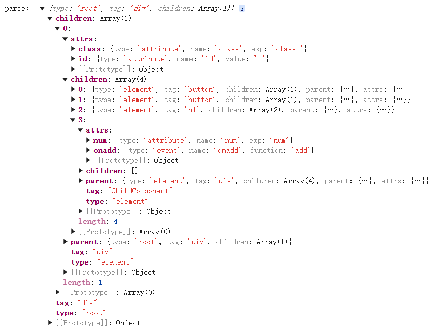
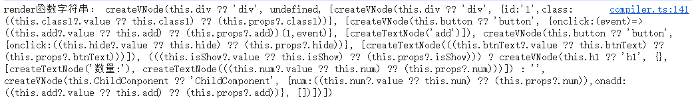

# vue原理深度剖析：渲染管线-编译
在看这篇文章之前建议阅读下vue官方文档:[渲染机制](https://cn.vuejs.org/guide/extras/rendering-mechanism.html)
文章里提到渲染管线有几个事：编译、挂载、更新。本文讲的是编译阶段。

## 虚拟dom
在说vue模版编译之前，必须先了解下虚拟dom，虚拟dom是需要进行模版编译的原因，也是模版编译的目的。

**什么是虚拟dom?**
虚拟dom是用js对象模拟的dom树，用js对象表示dom节点.

**为什么需要虚拟dom**
假设你是一位城市规划师，真实城市（真实 DOM）改造成本极高 —— 拆栋楼、拓条路都要大动干戈，还影响居民生活。
虚拟 DOM 就是你桌上的沙盘模型：
先在沙盘上随便改：挪建筑、拓街道，怎么试错都轻松。
改完后，对比新旧沙盘，只挑出「必须动的地方」。
最后照着清单去现场，只改这些地方，其他啥也不动。
这样就不用瞎折腾真实城市，少花钱、少扰民 —— 虚拟 DOM 就干这事儿。

## 模版编译阶段
模版编译的最终目的，就是输出一个可以生成虚拟dom树的函数：render渲染函数
要达成这个目的，需要经历几个过程：模版-》AST语法树-》render渲染函数
模版解析成AST语法树,需要模版解析器：parse模版解析器
AST语法树解析成render渲染函数,需要模版编译器：compile模版编译器
而vue3里做了一些编译时的优化，也就是对AST树进行优化标记，本篇先不涉及，为了让大家了解模版编译阶段的过程，我们只做最基本的功能分析

## 什么是AST抽象语法树
你可以把 AST 理解成「所有语言的通用骨架」，不止 Vue 模板里有，JavaScript、Python 甚至中文里都藏着它的影子。
拿说话举例子：中文有「主谓宾」的基本规矩（比如「我吃饭」），不管你说「我吃了一碗香喷喷的米饭」还是「他昨天在餐厅吃牛排」，骨子里都逃不开「谁 + 做 + 什么」这个骨架 —— 这就是中文的「语法结构规律」。
AST 做的事，就是把这种「骨架」抽出来：
比如 JavaScript 里，不管你写let a = 1 + 2还是const b = (3 * 4) / 5，AST 都会提炼出「声明变量→赋值→运算」的核心结构；
Babel 能把高版本 JS 转成低版本，靠的就是先把高版本代码拆成 AST（看懂骨架），再按低版本语法重新拼一遍这个骨架；
Vue 模板里的<div @click="fn">text</div>，AST 也会拆成「标签类型→事件绑定→文本内容」的骨架，方便 Vue 理解和渲染。
简单说，AST 就像语言的「X 光片」—— 不管表面文字多复杂，它总能照出最核心的结构骨架，让机器能看懂「这句话 / 这段代码到底在讲什么」。

## AST语法树-节点设计
需要考虑的因素有：
- 节点类型type:ROOT(根元素),ELEMENT(元素),TEXT(文本),INTERPOLATION(插值,也就是vue中{{...}}),
- 节点属性attrs:ATTRIBUTE(普通属性),DIRECTIVE(指令),EVENT(事件)
- 子节点children：子节点可以是元素，文本，插值
- 父节点parent：建立父子关系双向映射，方便回溯查找父节点
节点常规结构如下：
```js
{
    type: TYPE.ELEMENT|TYPE.TEXT|TYPE.INTERPOLATION,
    tag: 'div',  // type为ELEMENT元素时存在
    attrs:{  // type为ELEMENT元素时存在
        '属性名':{
            name:'属性名',
            type:TYPE.ATTRIBUTE|TYPE.DIRECTIVE|TYPE.EVENT,
            value:'静态属性值', // 静态值都统一用value，动态值用exp
            exp:'动态属性值', 
            function:'事件方法', // type为EVENT事件时存在
        },
    }, 
    value: '静态属性值',  
    exp:'动态属性值',  
    children:[], // type为ELEMENT元素时存在
    parent:parent,
}
```
## 模版解析器parse
解析模板字符串时，分为开始节点，结束节点，文本节点，插值节点。
不同节点的处理逻辑不同，需要根据不同节点类型进行处理。

```js
// compile.js
const TYPE =  {
    ROOT : 'root',
    ELEMENT :'element',  // 元素
    TEXT : 'text',  // 文本
    INTERPOLATION : 'interpolation',  // 插值
    DIRECTIVE : 'directive',  // 指令
    ATTRIBUTE : 'attribute',  // 属性
    EVENT : 'event' //事件
}
export const parse = function (template) {
  let i = 0
  const root = { type: TYPE.ROOT, tag: 'div', children: [] }
  let current = root
  template = template.trim()
  // 开始标签正则
  const startTagReg = /<(\w+)([^>]*)(\/?)>/
  // 结束标签正则
  const endTagREg = /<\/(\w+)>/
  // 插值正则
  const interReg = /{{([^}]+)}}/
  while (i < template.length) {
    const tempStr = template.slice(i)
    if (template[i] === '<') {
      const startMatch = tempStr.match(startTagReg)
      // 先判定是否是结束标签，结束标签重要逻辑是回到父级，不需要新增节点
      if (template[i + 1] === "/") {
        const endMatch = tempStr.match(endTagREg)
        // 如果结束标签和当前标签不匹配，或者没有父节点，抛出异常
        if (endMatch[1] !== current.tag || !current.parent) {
          throw new Error('模板不合法')
        } else {
          current = current.parent
          i = i + endMatch[0].length
        }
      } else if (startMatch) {
        // 开始标签。重要逻辑是添加节点，节点类型是元素
        const obj = {
          type: TYPE.ELEMENT,
          tag: startMatch[1],
          children: [],
          parent: current // 保持对父节点的引用
        }
        obj.attrs = getAttributes(startMatch[2])
        // 自结束标签
        if (startMatch[3]) {
          obj.isCloseSelf = true
        }
        // 添加节点，父子节点建立双向映射
        current.children.push(obj)
        // 更新当前操作节点
        current = obj
        i = i + startMatch[0].length
      } else {
        throw new Error('模板不合法')
      }
    } else if (template[i] === '{' && template[i + 1] === '{') {
      // 文本差值，重要逻辑是添加节点，节点类型是插值,没有子节点
      const interMatch = tempStr.match(interReg)
      if (interMatch) {
        const obj = {
          type: TYPE.INTERPOLATION,
          exp: interMatch[1].trim(),
          parent: current
        }
        current?.children?.push(obj)
      } else {
        throw new Error('模板不合法')
      }
      i = i + interMatch[0].length
    } else {
      // 普通文本，重要逻辑是添加节点，节点类型是文本,没有子节点
      // 找到下一个标签或者插值位置
      const aIndex = tempStr.indexOf('<')
      const bIndex = tempStr.indexOf('{{')
      const temp = (aIndex >= 0 && bIndex >= 0) ? Math.min(aIndex, bIndex) : Math.max(aIndex, bIndex)
      if (temp < 0) {
        throw new Error('模板不合法')
      }
      const text = template.slice(i, i + temp).trim()
      if (text) {
        const obj = {
          type: TYPE.TEXT,
          value: text,
          parent: current
        }
        current?.children?.push(obj)
      }
      i = i + temp
    }
  }
  console.log("parse：", root)
  return root
}
// 获取节点属性
const getAttributes = function (attrStr) {
  if (!attrStr) return
  const resultObj = {}
  const regex = /([^=\s]+)=?("([^"]*)"|'([^']*)')?/g;
  let match;
  while ((match = regex.exec(attrStr)) !== null) {
    let [name, _1, _2, _3] = match.slice(1);
    let value = (_3 || _2 || _1).trim()
    name = name?.trim()
    if (name.startsWith("@")) {
      // 事件     
      resultObj['on' + name.substring(1)] = {
        type: TYPE.EVENT,
        name: 'on' + name.substring(1),
        function: value
      }
    } else if (name.startsWith("v-")) {
      // 指令
      resultObj[name] = {
        type: TYPE.DIRECTIVE,
        name: name,
        exp: value
      }
    } else if (name.startsWith(":")) {
      // 动态属性
      resultObj[name.substring(1)] = {
        type: TYPE.ATTRIBUTE,
        name: name.substring(1),
        exp: value
      }
    } else {
      // 普通属性
      resultObj[name] = {
        type: TYPE.ATTRIBUTE,
        name,
        value
      }
    }
  }
  return resultObj
}
```
测试看下模版编译的结果：
```js
const template = `
 <div id="1" :class="class1">
   <button  @click="add">add</button>
   <button  @click="hide">{{btnText}}</button>
   <h1 v-if="isShow">数量:{{ num }}</h1>   
   <ChildComponent :num="num" @add="add"></ChildComponent>
 </div>
 `
const ast = parse(template)
```
parse结果如下：


## createVNode函数
在讲generate阶段之前，先了解下createVNode函数。
createVNode函数是创建虚拟dom的函数，它的参数是标签名，属性对象，子节点数组。

```js
// help.js
createVNode(tag, props, childrens) {
    return {
      tag,  // tag可以是普通dom标签，也可以是组件
      props,
      childrens,
      el: null, // 预留属性,真实的dom节点，虚拟dom和真实dom建立映射，如果tag为普通dom标签时存在，
      component: null  // 组件实例，虚拟dom与组件建立映射，如果tag为组件时存在，预留属性
    }
  },
```
## createTextNode函数
这里简单模拟，直接返回文本内容。
```js
// help.js
createTextNode(value) {
    return value
  },
```

## 模版编译器compile
这个环节的作用是把AST抽象语法树转成render渲染函数。如：
```js
function render(){
   return createVNode('div',{id:1,class:'red'，[createTextNode('我是div')]      
}
```

而render函数的内容是动态根据AST去生成的,所以它的内容需要用字符串来做拼接，最后使用new Function()把字符串转成函数。如：
```js
const funcStr = `
  return createVNode('div',{id:1,class:'red'，[createTextNode('我是div')]      
`
const render = new Function('createVNode','createTextNode',funcStr)
```
另一个关键点是对于模板中引用的动态值，需要正确的与当前组件的数据(setup的返回值)相关联。
```js
// 获取动态值的字符串,这里不考虑表达式的情况
const getExpStr = function (exp) {
    // 从当前作用域下取值，考虑值为ref的情况
    const thisExp = `(this.${exp}?.value ?? this.${exp})`;
    // 从props里取值,在vue里，会把props封装成reactive对象
    const propExp = `(this.props?.${exp})`
    // 优先取当前作用域下的值，最后是props的值    
    return `(${thisExp} ?? ${propExp})`;
}
```

generate阶段完整代码实现：
```js
export const generate = function (ast) {
    // 递归处理ast
    const resultStr = digui(ast)
    console.log("render函数字符串：", resultStr)
    // 把字符串转成真实的函数
    const render = new Function('createVNode', 'createTextNode', 'return ' + resultStr)
    return render
}
function digui(obj) {
    let str = ''
    // 对于不同的type，处理逻辑不同，文本和插槽比较简单，创建一个文本虚拟dom即可；
    // ELEMENT比较复杂，需要拼接子节点字符串，属性字符串，而属性还包括指令的处理(这里只简单模拟v-if)
    switch (obj.type) {
        case TYPE.ROOT:
        case TYPE.ELEMENT:
            // 拼接子节点字符串
            let childStr = obj?.children?.map((child, i) => digui(child, i)).join(', ')
            childStr = childStr ? `[${childStr}]` : '[]'            
            // 获取属性字符串
            const attrsStr = getPropsStr(obj)
            // 获取tag字符串
            const tagStr = getTag(obj.tag)
            // 指令处理
            if (obj.attrs?.['v-if']) {
                // v-if指令 
                // 获取指令的值
                const v = getExpStr(obj.attrs['v-if'].exp)
                // 如果值为true才创建虚拟dom，否则返回空字符
                str += `(${v}) ? createVNode(${tagStr}, ${attrsStr}, ${childStr}) : ''`
            } else {
                // 无指令的普通情况
                str += `createVNode(${tagStr}, ${attrsStr}, ${childStr})`
            }
            break;
        case TYPE.TEXT:
            str += `createTextNode('${obj.value}')`
            break;
        case TYPE.INTERPOLATION:
            str += `createTextNode(${getExpStr(obj.exp)})`
            break;
    }
    return str
}
// 获取属性字符串
const getPropsStr = function (obj) {
    const attrs = obj?.attrs
    if (!attrs) return
    let returnStr = ''
    Object.values(attrs).forEach((attr) => {
        if (!attr.name) return
        // 属性
        if (attr.type === TYPE.ATTRIBUTE) {
            if (attr.exp) {
                // 动态属性
                returnStr += `${attr.name}:${getExpStr(attr.exp)},`
            } else {
                // 普通属性
                returnStr += `${attr.name}:'${attr.value}',`
            }
        } else if (attr.type === TYPE.EVENT) {
            //事件
            const match = attr.function.match(/(.+)\((.*)\)/)
            // 如果事件处理器有传递参数，需要特殊处理
            let args = match?.[2].trim()
            if (args) {
                // 参数的最后追加event
                args = args ? `${args},event` : 'event'
                const funName = match?.[1]
                returnStr += `${attr.name}:(event)=>${getExpStr(funName)}(${args}),`
            } else {
                returnStr += `${attr.name}:${getExpStr(attr.function)},`
            }
        } else {
            // 其他指令 暂不模拟
        }
    })
    if (returnStr.endsWith(",")) {
        returnStr = returnStr.substr(0, returnStr.length - 1)
    }
    returnStr = `{${returnStr}}`
    return returnStr
}
// 获取动态值的字符串
const getExpStr = function (exp) {
    // 从当前作用域下取值，考虑值为ref的情况
    const thisExp = `(this.${exp}?.value ?? this.${exp})`;
    // 从props里取值,在vue里，会把props封装成reactive对象
    const propExp = `(this.props?.${exp})`
    // 优先取当前作用域下的值，最后是props的值    
    return `(${thisExp} ?? ${propExp})`;
}

// 获取tag字符串
// tag可以是普通dom，也可以是组件
// 组件需要注册，但在组合式写法里，组件通过setup返回，模版中即可使用。
// 我们这里假设组件通过setup返回后和data一样，直接挂在this下
const getTag = function (tag) {
    return `this.${tag} ?? '${tag}'`
}

```
测试看下模版编译的结果：
```js
const template = `
 <div id="1" :class="class1">
   <button  @click="add(1)">add</button>
   <button  @click="hide">{{btnText}}</button>
   <h1 v-if="isShow">数量:{{ num }}</h1>   
   <ChildComponent :num="num" @add="add"></ChildComponent>
 </div>
 `
const ast = parse(template)
generate(ast)
```
generate结果如下：


