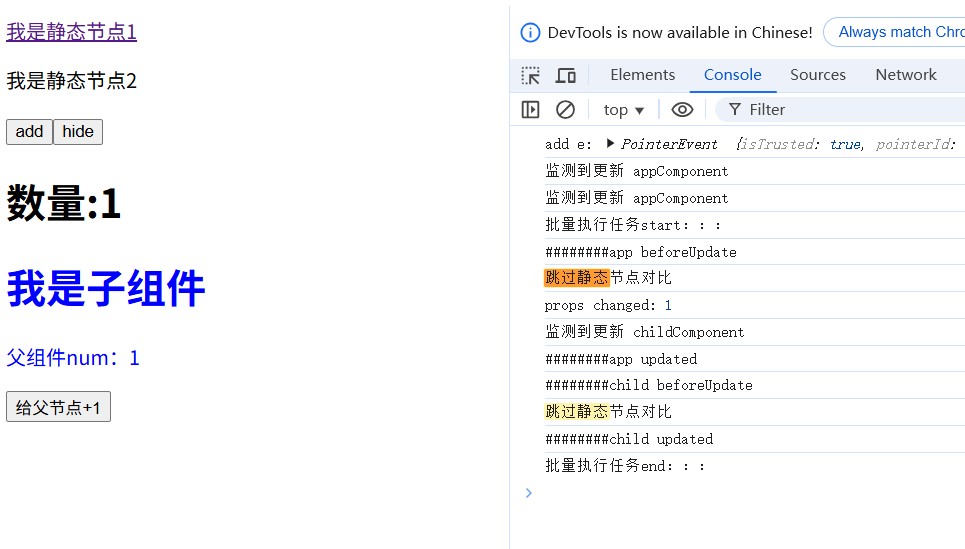
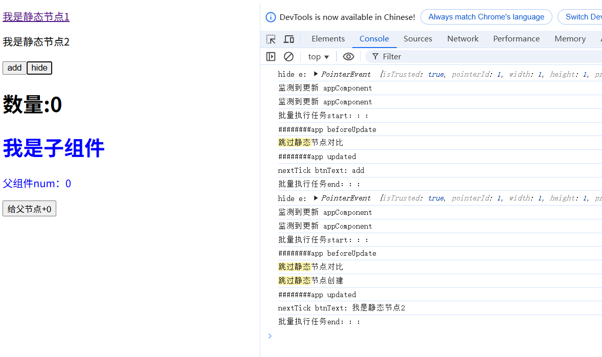

# vue3编译优化-更新类型标记、静态节点缓存
在vue官方文档[渲染机制](https://cn.vuejs.org/guide/extras/rendering-mechanism#compiler-informed-virtual-dom)有提到，Vue 编译阶段做了一些优化，让生成的虚拟 DOM带上编译时信息，以此来提高运行时的性能，具体优化有：更新类型标记，静态节点缓存，树结构打平。这些工作都是在transform转换阶段完成，也就是parse之后，generate之前
- 更新类型标记：运行阶段重点关注的是那些动态的元素，响应式数据更新后，就要生成新的虚拟dom，新旧虚拟dom树进行diff对比等等，那如果说提前就标记好你的改动有哪些，明确目标后再开始针对性的行动，class需要更新，我们就针对性的更新class，样式要更新我们就针对性的更新样式，目标明确任务执行起来要轻松不少
- 静态节点缓存：静态节点表示它永远不会更新，那么也就没有必要生成新的虚拟dom去进行diff对比，所以可以缓存起来重复使用
- 树结构打平：打平之后就是个简单的数组，只需要做遍历即可，而树结构需要做递归，遍历和递归的复杂性及性能消耗区别不言而喻

## 更新类型标记
### 分析
vue中对不同的更新做了不同的标记，如：
```js
const PatchFlags = {
    // 特殊标记：静态提升节点
    HOISTED: -1,
    // 0b00000001 - 动态文本内容（如{{ msg }}）
    TEXT: 1,
    // 0b00000010 - 动态class绑定（如:class="{ active }"）
    CLASS: 1 << 1,    // 2
    // 0b00000100 - 动态style绑定（如:style="styles"）
    STYLE: 1 << 2,    // 4
    // 0b00001000 - 动态props（非class/style的普通属性）
    PROPS: 1 << 3,   // 8
    // 0b10000 -动态子节点
    CHILDREN: 1 << 4,    //16
    // 0b100000 动态事件
    HYDRATE_EVENTS: 1 << 5,  //32
    // 0b1000000 动态指令
    DYNAMIC_DIRECTIVES: 1 << 6  //64
    // ...
}
```
更新可能不仅仅是一项，而是多项，vue采用的位运算来表示多项更新，这样的方式可以做到用一个变量就标识多项变化的效果，如：
```js
const patchFlags = PatchFlags.TEXT | PatchFlags.CLASS  //  0b00000011 也就是3
// 判断更新类型
if (patchFlags & PatchFlags.TEXT) {
  // 说明有动态文本
}
if (patchFlags & PatchFlags.CLASS) {
  // 说明有动态class
}
```

### 代码模拟实现
```js
// compiler.js
const PatchFlags = {
    // 特殊标记：静态提升节点
    HOISTED: -1,
    // 0b00000001 - 动态文本内容（如{{ msg }}）
    TEXT: 1,
    // 0b00000010 - 动态class绑定（如:class="{ active }"）
    CLASS: 1 << 1,    // 2
    // 0b00000100 - 动态style绑定（如:style="styles"）
    STYLE: 1 << 2,    // 4
    // 0b00001000 - 动态props（非class/style的普通属性）
    PROPS: 1 << 3,   // 8
    // 0b10000 -动态子节点
    CHILDREN: 1 << 4,    //16
    // 0b100000 动态事件
    HYDRATE_EVENTS: 1 << 5,  //32
    // 0b1000000 动态指令
    DYNAMIC_DIRECTIVES: 1 << 6  //64
    // ...
}
const markPatchFlag = function (ast) {
    // 如果节点类型是元素
    if (ast.type === TYPE.ELEMENT) {
        ast.patchFlag = 0
        for (let key in ast.attrs) {
            const value = ast.attrs[key]
            // 动态事件
            if (value.function) {
                ast.patchFlag |= PatchFlags.HYDRATE_EVENTS
            }
            if (value.exp) {
                // 动态指令
                if (value.type === TYPE.DIRECTIVE) {
                    ast.patchFlag |= PatchFlags.DYNAMIC_DIRECTIVES
                } else if (value.type === TYPE.ATTRIBUTE) {
                    // 动态class
                    if (value.name === 'class') {
                        ast.patchFlag |= PatchFlags.CLASS
                    } else if (value.name === 'style') {
                        // 动态样式
                        ast.patchFlag |= PatchFlags.STYLE
                    } else {
                        // 动态属性
                        ast.patchFlag |= PatchFlags.PROPS
                        // 收集动态属性
                        if (!ast.dynamicProps) {
                            ast.dynamicProps = []
                        }
                        ast.dynamicProps.push(key)
                    }
                }
            }
        }
    } else if (ast.type === TYPE.INTERPOLATION) {
        // 动态文本
        ast.parent.patchFlag |= PatchFlags.TEXT
    }
    // 处理子节点
    ast.children?.forEach((child) => {
        const childPathcFlag = markPatchFlag(child)
        if (childPathcFlag && childPathcFlag !== PatchFlags.HOISTED) {
            ast.patchFlag |= PatchFlags.CHILDREN
        }
    })
    // 该节点为静态节点
    if (ast.patchFlag === 0) {
        ast.patchFlag = PatchFlags.HOISTED
        ast.isDynamic = false
    } else if (ast.patchFlag) {
        ast.isDynamic = true
    }
    return ast.patchFlag
}
// digui函数有调用createVNode函数的地方，需增加一个参数patchFlag
function digui(obj) {   
   //...
    if (obj.attrs?.['v-if']) {
        // v-if指令 
        // 获取指令的值
        const v = getExpStr(obj.attrs['v-if'].exp)
        // 如果值为true才创建虚拟dom，否则返回空字符
        str += `(${v}) ? createVNode(${tagStr}, ${attrsStr}, ${childStr},${obj.patchFlag}) : ''`
    } else {
        // 无指令的普通情况
        str += `createVNode(${tagStr}, ${attrsStr}, ${childStr},${obj.patchFlag})`
    }   
    //...
}
// getPropsStr函数也要增加处理动态属性的逻辑
const getPropsStr = function (obj) {
    // ...
  // 动态属性处理
    if(obj.dynamicProps?.length > 0){
        returnStr += `$dynamicProps:${JSON.stringify(obj.dynamicProps)},`
    }   
    Object.values(attrs).forEach((attr) => {
        // ...
    })
    // ...
}

```

```js
// help.js
// createVNode函数也有所调整，返回对象增加patchFlag、$dynamicProps属性
 createVNode(tag, props = {}, childrens, patchFlag) {
    const { $dynamicProps, ...cleanProps } = props;
    return {
      tag,  // tag可以是普通dom标签，也可以是组件
      props: cleanProps,
      childrens,
      el: null, // 真实的dom节点，如果tag为普通dom标签时存在，预留属性
      component: null, // 组件实例，如果tag为组件时存在，预留属性
      patchFlag,  // 动态更新标记
      $dynamicProps: props?.$dynamicProps || [],  // 动态属性
    }
  },
```

## 静态节点缓存
### 分析
静态节点有更加简单直接的插入方式，就是innerHtml，如果还有很多的子节点，都统一用innerHtml方式插入，都不用递归处理了
怎么缓存静态节点以便重复使用呢？
1. **新增静态虚拟节点的创建方式**:创建方式createStaticNode，接收参数content，也就是模版字符串
2. **提取静态节点**: 如果ast节点为静态节点，将静态节点序列化为模板字符串，存放到列表里;同时ast节点设置索引属性，与模版字符串建立关联

3. **生成静态虚拟节点变量**:生成render函数内容前，遍历列表，根据索引生成变量名，变量提升到render函数之外
4. **变量替换**:render函数生成时，用变量名替换createStaticNode

### 代码模拟实现
```js
// help.js
// 1.新增静态节点虚拟dom的创建方式createStaticNode
 createStaticNode(content) {
    return {
      isStatic: true, // 是否是静态节点标识
      el: null, // 真实的dom节点
      // content, // 模版字符串
      // 这里用mount函数代替简单的content属性，实现真实dom的缓存
      mount: (() => {
        // 静态虚拟dom可以缓存，那对应的真实dom也可以缓存
        // 使用闭包缓存真实dom，以便运行阶段反复使用
        let cacheDom = null
        return () => {
          if (!cacheDom) {
            const temp = document.createElement('template')
            temp.innerHTML = content
            cacheDom = temp.content
          } else {
            console.log("跳过静态节点创建")
          }
          // 当缓存后的 template.content 被插入真实DOM后，浏览器会清空片段内容
          // 所以需要克隆下
          return cacheDom.cloneNode(true); 
        }
      })()
    }
  },
// ...
```

```js
// compiler.js
// ...
// 2. 如果ast节点为静态节点，将静态节点序列化为模板字符串，存放到列表里;同时ast节点设置索引属性，与模版字符串建立关联
let hoistedList = []
const staticNodeCache = function (ast) {
    // 判断是否是静态节点
    if (!ast.isDynamic && ast.patchFlag === PatchFlags.HOISTED) {
        ast.isStatic = true
        // 将静态节点序列化为模板字符串，存放到列表里
        hoistedList.push(serializeNode(ast))
        // ast节点设置索引属性，与模版字符串建立关联
        ast.hoistedIndex = hoistedList.length - 1
    } else if (ast.children && ast.children.length > 0) {
        // 递归处理子节点
        ast.children.forEach((child) => {
            staticNodeCache(child)
        })
    }
}
// 将静态节点序列化为模板字符串
const serializeNode = function (ast) {
    // 文本节点直接返回
    if (ast.type === TYPE.TEXT) {
        return ast.value
    }
    // 处理属性
    const propsArray = []
    for (let k in ast.attrs) {
        const v = ast.attrs[k]?.value
        propsArray.push(`${k} = "${v}"`)
    }
    const propsStr = propsArray.join(" ")
    if (ast.isCloseSelf) {
        return `<${ast.tag} ${propsStr}/>`
    } else {
        // 处理子节点
        let childrenArray, childrenStr = ''
        if (ast.children) {
            childrenArray = ast.children.map((child) => {
                return serializeNode(child)
            })
            childrenStr = childrenArray.join("")
        }
        return `<${ast.tag} ${propsStr}>${childrenStr}</${ast.tag}>`
    }
}
// 3. 生成render函数内容前，遍历列表，根据索引生成变量名，变量提升到render函数之外
export const generate = function (ast) {
    // 生成静态节点变量声明
    const hoistedDeclarations = hoistedList.map((item, i) => {
        return `const _hoisted_${i} = createStaticNode('${item}')`
    }).join(';\n')
    // 重置静态节点列表
    hoistedList = []
    // 递归处理ast
    const resultStr = digui(ast)
    // 把字符串转成真实的函数
    // 把变量提取到render函数之外
    // 这里的render函数写法要注意不要用箭头函数，不然上下文this会有问题
    const funcStr = `
        ${hoistedDeclarations}
        const render = function(){
           return ${resultStr}
        }
        return render
    `
    const func = new Function('createVNode', 'createTextNode', 'createStaticNode', funcStr)
    const renderFunc = func(h.createVNode,h.createTextNode,h.createStaticNode)
    console.log("render函数：",renderFunc)
    return renderFunc
}
// 4. render函数生成时，用变量名替换createStaticNode
function digui(obj) {
    let str = ''
    if (obj.isStatic) {
        // 根据索引得到变量名
        str += `_hoisted_${obj.hoistedIndex}`
    } else {
        // 其他原代码
        // ...
    }
    return str
}
```
### 应用
```js
// compiler.js
export const tranform = function (ast) {
    // 更新类型标记
    markPatchFlag(ast)
    // 静态节点缓存
    staticNodeCache(ast)
}
```

```js
// runtime.js
const createComponentIntance = function (component, props, _instance) {
    //...
    // 编译模板
    if (!render && template) {
        const ast = parse(template)
        // 转化ast，进行优化操作
        tranform(ast)
        renderFun = generate(ast)
    }
    //...
}
const commonMount = function ({ instance, parentDom, insertIndex }) {
    // ...
            // render函数的调用不再需要传递参数
            const vnode = instance.render();
    // ...
        
    }
export const update = function (componentInstance) {
   // ...
    // render函数的调用不再需要传递参数
    const newVnode = componentInstance.render()
   //...
}
const createDomDuiGui = function ({ instance, vnode, parentDom, insertIndex }) {
    if (!vnode) return
    let dom
    // 如果是静态节点
    if (vnode.isStatic) {        
        dom = vnode.mount()
    } else {
        //...
    }
    // 虚拟节点与真实节点建立映射
    vnode.el = dom
    // 3.插入dom
    // ...
}
// 新的diff函数
// 参数1:旧的Vnode树
// 参数2:新的Vnode树
// 参数3:父节点
// 参数4:在父节点中插入的位置
const diff = function (oldVnodeTree, VnodeTree, parentDom, insertIndex) {
    // 节点相同不需要对比，直接返回
    // 静态节点用的缓存节点，所以新旧节点一定是相等的
    if (oldVnodeTree === VnodeTree) {
        if(oldVnodeTree.isStatic){
            console.log("跳过静态节点对比")
        }else{
            console.log("其他节点相同情况")
        }
        return
    }    
    if (!isSameVNodeType(oldVnodeTree, VnodeTree)) {
        // 1. 如果节点不是同类型，直接删除创建新节点
        // 删除旧节点
        (parentDom || dom.parentElement).removeChild(dom)
        // 创建新节点
        mount({ vnode: VnodeTree, parentDom, insertIndex })
        return
    } else {
        const dom = oldVnodeTree.el
        // 动态文本
        if (oldVnodeTree.patchFlag & PatchFlags.TEXT) {
            const newText = VnodeTree.childrens.join("")
            const oldText = oldVnodeTree.childrens.join("")
            if (oldText !== newText) {
                dom.innerText = newText
            }
            // 如果是动态文本，说明没有子节点了，直接返回
            VnodeTree.el = oldVnodeTree.el
            return
        }
        // dom属性有更新
        const oldProps = oldVnodeTree.props
        const newProps = VnodeTree.props
        // 动态class
        if (oldVnodeTree.patchFlag & PatchFlags.CLASS) {
            if (oldProps.class !== newProps.class) {
                typeof VnodeTree.tag === 'object' ? dom.props.class = newProps.class : dom.setAttribute('class', newProps.class)
            }
        }
        // 动态样式
        if (oldVnodeTree.patchFlag & PatchFlags.STYLE) {
            const newStyle = VnodeTree.props.style
            for (let styleK in newStyle) {
                if (dom.style[styleK] !== newStyle[styleK]) {
                    typeof VnodeTree.tag === 'object' ? (dom.props.style[styleK] = newStyle[styleK]) : (dom.style[styleK] = newStyle[styleK])
                }
            }
        }
        // 动态属性
        if (oldVnodeTree.patchFlag & PatchFlags.PROPS) {
            // 只遍历动态属性，非动态的不处理
            const dynamicProps = oldVnodeTree.$dynamicProps
            dynamicProps.forEach((k) => {
                if (oldProps[k] !== newProps[k]) {
                    const v = newProps[k]
                    typeof VnodeTree.tag === 'object' ? (dom.props[k] = v) : dom.setAttribute(k, v)
                }
            })
        }
        if (oldVnodeTree.patchFlag & PatchFlags.HYDRATE_EVENTS) {
            // 在目前我们模拟的情况下，事件处理函数不会变化，所以这里暂不写逻辑
        }
        if (oldVnodeTree.patchFlag & PatchFlags.DYNAMIC_DIRECTIVES) {
            // 在目前我们模拟的情况下，只实现了v-if指令，这个指令的逻辑在generate时就处理过了，所以这里暂不写逻辑
        }

        VnodeTree.el = oldVnodeTree.el
        // 处理子节点
        if (oldVnodeTree.patchFlag & PatchFlags.CHILDREN) {
            diffChildren(oldVnodeTree.childrens || [], VnodeTree.childrens || [], oldVnodeTree.el)
        }
    }

}  
```
```js
// appComponent.js
// 模版进行调整，增加静态节点元素
// 定义模板
const template = `
  <div id="1" :class="class1">
   <a href="https://www.baidu.com" target="_blank">我是静态节点1</a>
   <div id="2" v-if="isShow"><p>我是静态节点2</p>  </div>
   <button  @click="add(1)">add</button>
   <button  @click="hide">{{btnText}}</button>
   <h1  >数量:{{ num }}</h1>   
   <ChildComponent    :num="num" @add="add"></ChildComponent>
 </div>
 `
```
### 执行结果
点击add按钮后，跳过静态节点对比2次

点击hide按钮隐藏再显示，跳过静态节点对比2次，创建1次


